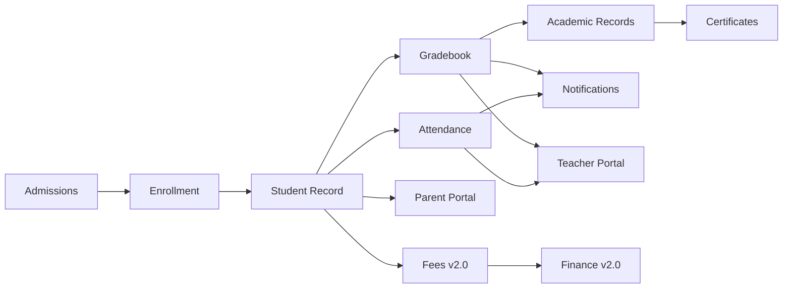

# EduTrack — Product Experience Specification

| Field | Value |
|-------|-------|
| **Document ID** | EDU-PX-004 |
| **Version** | 1.0.0 |
| **Status** | Draft — Pending G4 Stakeholder Approval |
| **Phase** | Phase 4 — Product Experience |
| **Predecessor** | EDU-DISC-001 · EDU-STRAT-002 · EDU-PRD-003 — **Approved** |
| **Successor** | EDU-ARCH-005 (Phase 5 — Technical Architecture) — *Pending G4* |
| **Author** | EduTrack Product Experience Organization |
| **Last Updated** | 2026-07-08 |
| **Classification** | Internal — Confidential |

---

## Document Control

| Version | Date | Author | Changes |
|---------|------|--------|---------|
| 1.0.0 | 2026-07-08 | Product Experience | Initial Product Experience Specification |

### Experience ID Convention

| Prefix | Meaning | Example |
|--------|---------|---------|
| `PX-SCR-###` | Screen | PX-SCR-042 |
| `PX-FLW-###` | User Flow | PX-FLW-008 |
| `PX-DSH-###` | Dashboard Element | PX-DSH-003 |
| `PX-CMP-###` | Component | PX-CMP-015 |
| `PX-INT-###` | Interaction Pattern | PX-INT-007 |

### Approval Gate — G4: Product Experience Approval

| Role | Name | Signature | Date | Status |
|------|------|-----------|------|--------|
| VP Product Experience | | | | Pending |
| UX Research Lead | | | | Pending |
| Chief Product Officer | | | | Pending |
| Principal Product Manager | | | | Pending |
| Enterprise Solution Architect | | | | Pending |
| Accessibility Lead | | | | Pending |
| VP Engineering | | | | Pending |

**Gate criteria:** Information architecture validated; screen inventory complete for MVP; user flows approved by UX research; accessibility requirements meet WCAG 2.2 AA; RTL experience defined; mobile experience strategy agreed; component inventory sufficient for design system kickoff; no open P0 experience ambiguities blocking Technical Architecture.

**Explicit constraint:** No wireframes, visual designs, Figma files, source code, API specifications, or database schemas shall be produced until **G4 approval** is recorded.

---

## Table of Contents

1. [Executive Summary](#1-executive-summary)
2. [Information Architecture](#2-information-architecture)
3. [Screen Inventory](#3-screen-inventory)
4. [User Flows](#4-user-flows)
5. [Dashboard Experience](#5-dashboard-experience)
6. [Navigation Experience](#6-navigation-experience)
7. [Mobile Experience](#7-mobile-experience)
8. [UX Principles](#8-ux-principles)
9. [Interaction Patterns](#9-interaction-patterns)
10. [Notification Experience](#10-notification-experience)
11. [AI Experience](#11-ai-experience)
12. [Accessibility](#12-accessibility)
13. [Design Foundations](#13-design-foundations)
14. [Component Inventory](#14-component-inventory)
15. [Experience Metrics](#15-experience-metrics)
16. [Risks](#16-risks)
17. [Experience Roadmap](#17-experience-roadmap)
18. [Approval Gate](#18-approval-gate)

---

## 1. Executive Summary

This Product Experience Specification defines **how users interact with EduTrack** — the complete user experience layer that bridges Product Requirements (Phase 3) and Technical Architecture (Phase 5).

EduTrack serves 10+ distinct user roles across web and mobile, in Arabic and English, across single-campus schools and 20-campus school groups. The experience must feel **enterprise-grade, calm, and efficient** — not like a consumer social app, and not like a legacy government portal.

### Product Experience Vision

> **Every school stakeholder — from a parent in Doha to a principal in Dubai — completes their most important tasks in EduTrack with clarity, confidence, and minimal effort, in the language they prefer.**

### UX Philosophy

EduTrack experience is built on five beliefs:

1. **School software is mission-critical** — Errors affect children, families, and compliance. The experience must prevent mistakes, not merely recover from them.
2. **Arabic is not a translation** — RTL layout, reading direction, iconography, and information hierarchy are designed Arabic-first alongside English.
3. **Role-based, not feature-based** — Users see their world (my classes, my children, my school), not a catalog of modules.
4. **Daily tasks in seconds** — Attendance, grade entry, and parent messaging must be completable in under 15 minutes total per teacher per day.
5. **Trust through transparency** — Audit trails, confirmation states, and AI explainability are visible in the experience, not hidden in admin consoles.

### Experience Principles

| Principle | Definition | Product Implication |
|-----------|------------|---------------------|
| **Clarity** | Users always know where they are, what they can do, and what happens next | Persistent navigation, breadcrumbs, explicit labels |
| **Efficiency** | Minimum steps for high-frequency tasks | Quick actions, defaults, bulk operations |
| **Consistency** | Same patterns everywhere | Unified component library, predictable layouts |
| **Inclusion** | Arabic and English at parity; accessibility by default | RTL-native, WCAG 2.2 AA, reduced motion |
| **Calm** | Reduce anxiety for parents; reduce burnout for teachers | Clear status, no alarmist UI, progressive disclosure |
| **Accountability** | Actions are traceable | Confirmations, audit visibility, undo where safe |

### Design Goals

| Goal | Metric | Target |
|------|--------|--------|
| Teacher daily admin time | Time on task | ≤15 minutes |
| Parent activation | Account activation rate | ≥55% within 30 days |
| Task completion rate | Core flows completed without help | ≥90% |
| First-value time | Parent first meaningful session | ≤14 days post go-live |
| Accessibility | WCAG 2.2 AA conformance | 100% core flows |
| RTL quality | Arabic layout defect rate | Zero P0 RTL bugs at launch |
| Mobile parity | Core teacher/parent actions on mobile | 100% of P0 flows |
| Error recovery | Users recover from errors without support | ≥85% |

### Product Personality

| Attribute | EduTrack Is | EduTrack Is Not |
|-----------|-------------|-----------------|
| **Tone** | Professional, warm, trustworthy | Cold, bureaucratic, playful |
| **Visual feel** | Clean, spacious, confident | Cluttered, dense, flashy |
| **Language** | Plain, direct, bilingual | Jargon-heavy, translation-afterthought |
| **Motion** | Purposeful, subtle | Distracting, excessive |
| **Density** | Progressive — simple default, depth on demand | Everything visible at once |
| **Brand** | The operating system for modern schools | A generic admin panel |

**Personality reference:** Atlassian's enterprise clarity + Linear's efficiency + Google's accessibility discipline + Apple's calm confidence.

---

## 2. Information Architecture

### Platform Topology

EduTrack is organized as **four experiential portals** plus **shared platform services**:

```
┌─────────────────────────────────────────────────────────────────┐
│                     EduTrack Platform                            │
├──────────────┬──────────────┬──────────────┬─────────────────────┤
│ Admin Portal │Teacher Portal│ Parent Portal│ Student Portal (v1.1) │
│ (Staff)      │              │ (+ Mobile)   │                     │
├──────────────┴──────────────┴──────────────┴─────────────────────┤
│ Shared: Search · Notifications · Calendar · Messages · Profile   │
├──────────────────────────────────────────────────────────────────┤
│ Settings · Integrations · Reports · Analytics · AI (phased)      │
└──────────────────────────────────────────────────────────────────┘
```

### Global Navigation

| Element | Position | Behavior |
|---------|----------|----------|
| **Logo / School name** | Top-leading (LTR) / Top-trailing (RTL) | Links to role dashboard |
| **Global search** | Top center | Cmd/Ctrl+K; searches students, staff, screens |
| **Notifications** | Top bar | Badge count; panel on click |
| **Messages** | Top bar | Unread indicator; links to inbox |
| **Language toggle** | Top bar | AR ↔ EN; persists per user |
| **Profile menu** | Top-trailing (LTR) | Account, preferences, sign out |
| **Help** | Top bar / profile | Contextual help, Academy link |

### Sidebar Structure — Admin Portal

| Group | Items | Depth |
|-------|-------|-------|
| **Home** | Dashboard | L1 |
| **People** | Students, Staff, Parents, Admissions | L1 → L2 list/detail |
| **Academics** | Enrollment, Attendance, Gradebook, Academic Records, Scheduling, Homework*, Assessments*, Certificates* | L1 → L2 |
| **Engagement** | Messages, Calendar, Documents | L1 → L2 |
| **Operations** | Finance*, Fees*, HR*, Payroll*, Transport*, Clinic*, Library*, Inventory*, Assets*, Behavior* | L1 → L2 |
| **Insights** | Reports, Analytics, AI Insights* | L1 → L2 |
| **System** | Settings, Integrations, CMS*, Marketplace* | L1 → L2 → L3 |

*\* = Phased release per PRD*

**Max navigation depth:** 3 levels (Module → List → Detail/Action). Deeper workflows use tabs within detail views, not deeper sidebar nesting.

### Sidebar Structure — Teacher Portal

| Group | Items |
|-------|-------|
| **Home** | Dashboard |
| **Today** | My Schedule, Attendance, Quick Grade |
| **Classes** | Class list → Class detail (roster, grades, attendance, messages) |
| **Messages** | Inbox |
| **Calendar** | Personal + school events |
| **More** | Homework*, Assessments*, Profile |

### Sidebar Structure — Parent Portal

| Group | Items |
|-------|-------|
| **Home** | Dashboard (multi-child) |
| **Children** | Per-child: Overview, Attendance, Grades, Schedule, Messages |
| **Messages** | Inbox |
| **Calendar** | Family calendar |
| **Fees** | Invoices, payments* (v2.0) |
| **More** | Documents, Settings, Help |

### Portal Structure — Student Portal (v1.1)

| Group | Items |
|-------|-------|
| **Home** | Dashboard |
| **Today** | Schedule, Homework |
| **Academics** | Grades, Assignments |
| **Messages** | Inbox (if enabled) |
| **Calendar** | Personal schedule |

### Settings Structure

```
Settings
├── School Profile (name, logo, timezone, locale)
├── Academic Configuration
│   ├── Academic Years & Terms
│   ├── Grade Levels & Sections
│   └── Grading Policies
├── Users & Access
│   ├── Users
│   ├── Roles & Permissions
│   └── SSO / Authentication
├── Communication
│   ├── Notification Defaults
│   └── Message Policies
├── Finance Configuration* (v2.0)
├── Integrations
├── Audit Log
└── Multi-Campus* (school groups)
```

### Dashboard Hierarchy

| Role | Default Landing | Secondary Dashboards |
|------|---------------|---------------------|
| Principal | School Health Dashboard | Analytics, Reports |
| Registrar | Enrollment Dashboard | Admissions pipeline |
| Teacher | Today Dashboard | Per-class views |
| Parent | Family Dashboard | Per-child views |
| Student | Today Dashboard | — |
| Finance Officer | Finance Dashboard* | AR aging, collections |
| HR Manager | HR Dashboard* | Leave, headcount |
| Super Admin | System Overview | Audit, integrations |
| Platform Operator | Tenant Console (separate) | — |

### Feature Relationships



### Navigation Depth Rules

| Rule | Specification |
|------|---------------|
| **Max sidebar depth** | 3 levels |
| **Max clicks to any P0 screen** | ≤3 from dashboard |
| **Max clicks to daily teacher tasks** | ≤2 from dashboard |
| **Detail views** | Use tabs (Overview, Attendance, Grades, Documents, History) not new sidebar items |
| **Settings** | Separate settings area; not mixed with operational modules |

### Breadcrumb Rules

| Rule | Specification |
|------|---------------|
| **Visibility** | Show on all L2+ screens |
| **Format** | Home → Module → List → Detail |
| **Clickable** | All segments except current page |
| **RTL** | Separator and order mirror for Arabic |
| **Truncation** | Middle segments collapse with ellipsis on mobile |

### Search Strategy

| Search Type | Scope | Entry Point |
|-------------|-------|-------------|
| **Global search** | Students, staff, parents, screens | Cmd/Ctrl+K; top bar |
| **Module search** | Within current list (students, applicants, etc.) | List toolbar |
| **Filter search** | Faceted filters on list views | Filter panel |
| **Smart search** (v2.0 AI) | Natural language queries on permitted data | Global search bar |

**Search behavior:** Results grouped by type; recent searches saved; minimum 2 characters; results in <1 second for 5,000 students.

---

## 3. Screen Inventory

### Inventory Legend

| Priority | Release |
|----------|---------|
| P0 | v1.0 MVP |
| P1 | v1.1 |
| P2 | v2.0 |
| P3 | v3.0 |
| P4 | v4.0+ |

### Authentication

| ID | Screen | Purpose | Primary Users | Business Value | Priority | Release |
|----|--------|---------|---------------|----------------|----------|---------|
| PX-SCR-001 | Sign In | Authenticate users | All | Secure access | P0 | v1.0 |
| PX-SCR-002 | Sign In (SSO) | Google/Microsoft SSO | Staff | Reduced password friction | P1 | v1.1 |
| PX-SCR-003 | Forgot Password | Password recovery | All | Self-service recovery | P0 | v1.0 |
| PX-SCR-004 | MFA Challenge | Multi-factor verification | Admin roles | Security compliance | P0 | v1.0 |
| PX-SCR-005 | Parent Activation | First-time parent onboarding | Parent | Activation ≥55% | P0 | v1.0 |
| PX-SCR-006 | Session Expired | Re-authenticate prompt | All | Security | P0 | v1.0 |

### Dashboard

| ID | Screen | Purpose | Primary Users | Business Value | Priority | Release |
|----|--------|---------|---------------|----------------|----------|---------|
| PX-SCR-010 | Principal Dashboard | School health overview | Principal | Executive visibility | P0 | v1.0 |
| PX-SCR-011 | Registrar Dashboard | Enrollment operations | Registrar | Daily efficiency | P0 | v1.0 |
| PX-SCR-012 | Teacher Dashboard | Today view | Teacher | ≤15 min admin | P0 | v1.0 |
| PX-SCR-013 | Parent Dashboard | Multi-child family view | Parent | NPS driver | P0 | v1.0 |
| PX-SCR-014 | Student Dashboard | Today schedule & tasks | Student | Engagement | P1 | v1.1 |
| PX-SCR-015 | Finance Dashboard | Revenue & collections | Finance | Expansion revenue | P2 | v2.0 |
| PX-SCR-016 | HR Dashboard | Headcount & leave | HR | Operations | P2 | v2.0 |
| PX-SCR-017 | System Dashboard | IT health & usage | Super Admin | Governance | P0 | v1.0 |
| PX-SCR-018 | Analytics Dashboard | Deep metrics | Principal, Admin | Data-driven decisions | P0 | v1.0 |

### Students

| ID | Screen | Purpose | Primary Users | Business Value | Priority | Release |
|----|--------|---------|---------------|----------------|----------|---------|
| PX-SCR-020 | Student List | Browse/search students | Admin, Registrar | Single source of truth | P0 | v1.0 |
| PX-SCR-021 | Student Profile | Complete student record | Admin, Teacher* | 360° view | P0 | v1.0 |
| PX-SCR-022 | Student Create/Edit | Add or modify student | Registrar | Data accuracy | P0 | v1.0 |
| PX-SCR-023 | Guardian Management | Link/manage guardians | Registrar | Parent access | P0 | v1.0 |
| PX-SCR-024 | Student History | Lifecycle audit trail | Admin, Principal | Compliance | P0 | v1.0 |
| PX-SCR-025 | Medical Alerts | Allergy/condition flags | Admin, Nurse* | Safety | P3 | v3.0 |

### Admissions

| ID | Screen | Purpose | Primary Users | Business Value | Priority | Release |
|----|--------|---------|---------------|----------------|----------|---------|
| PX-SCR-030 | Admissions Pipeline | Kanban/list pipeline | Admissions | Revenue pipeline | P0 | v1.0 |
| PX-SCR-031 | Applicant Detail | Single applicant 360° | Admissions | Conversion tracking | P0 | v1.0 |
| PX-SCR-032 | Public Application Form | Parent-facing apply | Parent (prospect) | Lead capture | P0 | v1.0 |
| PX-SCR-033 | Offer Management | Generate/send offers | Admissions | Enrollment acceleration | P0 | v1.0 |
| PX-SCR-034 | Waitlist | Manage waitlisted applicants | Admissions | Capacity management | P0 | v1.0 |
| PX-SCR-035 | Admissions Analytics | Funnel metrics | Principal, Admissions | Forecasting | P0 | v1.0 |

### Enrollment

| ID | Screen | Purpose | Primary Users | Business Value | Priority | Release |
|----|--------|---------|---------------|----------------|----------|---------|
| PX-SCR-040 | Enrollment List | Active enrollments by year | Registrar | Operations | P0 | v1.0 |
| PX-SCR-041 | Enroll Student | Single enrollment wizard | Registrar | Zero re-entry | P0 | v1.0 |
| PX-SCR-042 | Bulk Re-enrollment | Annual rollover | Registrar | Scale efficiency | P0 | v1.0 |
| PX-SCR-043 | Section Assignment | Assign to class/section | Registrar | Capacity control | P0 | v1.0 |
| PX-SCR-044 | Promotion Wizard | End-of-year promotion | Academic Admin | Academic cycle | P0 | v1.0 |

### Attendance

| ID | Screen | Purpose | Primary Users | Business Value | Priority | Release |
|----|--------|---------|---------------|----------------|----------|---------|
| PX-SCR-050 | Attendance Marking | Daily/period marking | Teacher | Daily engagement | P0 | v1.0 |
| PX-SCR-051 | Attendance Register | Historical view by class | Admin, Teacher | Compliance | P0 | v1.0 |
| PX-SCR-052 | Attendance Reports | Summary reports | Admin, Principal | Inspection | P0 | v1.0 |
| PX-SCR-053 | Attendance Lock | Lock/unlock periods | Academic Admin | Data integrity | P0 | v1.0 |

### Grades

| ID | Screen | Purpose | Primary Users | Business Value | Priority | Release |
|----|--------|---------|---------------|----------------|----------|---------|
| PX-SCR-060 | Gradebook Grid | Enter/view grades | Teacher | Core workflow | P0 | v1.0 |
| PX-SCR-061 | Grade Categories | Configure weights | Academic Admin | Policy enforcement | P0 | v1.0 |
| PX-SCR-062 | Grade Review | Review before publish | Academic Admin | Quality control | P0 | v1.0 |
| PX-SCR-063 | Grade History | Audit trail | Admin, Principal | Inspection | P0 | v1.0 |
| PX-SCR-064 | Parent Grade View | Published grades | Parent | Transparency | P0 | v1.0 |

### Homework (v1.1)

| ID | Screen | Purpose | Primary Users | Business Value | Priority | Release |
|----|--------|---------|---------------|----------------|----------|---------|
| PX-SCR-070 | Homework List | Assignments by class | Teacher | Workflow | P1 | v1.1 |
| PX-SCR-071 | Homework Create | Create assignment | Teacher | Parent visibility | P1 | v1.1 |
| PX-SCR-072 | Homework Detail (Parent) | View assignments | Parent, Student | Engagement | P1 | v1.1 |

### Assessments (v1.1)

| ID | Screen | Purpose | Primary Users | Business Value | Priority | Release |
|----|--------|---------|---------------|----------------|----------|---------|
| PX-SCR-080 | Exam Schedule | Exam timetable | Academic Admin | Academic cycle | P1 | v1.1 |
| PX-SCR-081 | Exam Grade Entry | Enter exam results | Teacher | Report cards | P1 | v1.1 |
| PX-SCR-082 | Results Publication | Publish to parents | Academic Admin | Controlled release | P1 | v1.1 |

### Reports & Analytics

| ID | Screen | Purpose | Primary Users | Business Value | Priority | Release |
|----|--------|---------|---------------|----------------|----------|---------|
| PX-SCR-090 | Report Catalog | Browse available reports | Admin, Principal | Self-service | P0 | v1.0 |
| PX-SCR-091 | Report Builder/Run | Configure and generate | Admin | Inspection readiness | P0 | v1.0 |
| PX-SCR-092 | Compliance Templates | KHDA/ADEK/MOEHE packs | Principal | Regulatory | P0 | v1.0 |
| PX-SCR-093 | Analytics Explorer | Drill-down metrics | Principal | Decision support | P0 | v1.0 |

### Finance, Fees, HR (v2.0)

| ID | Screen | Purpose | Primary Users | Business Value | Priority | Release |
|----|--------|---------|---------------|----------------|----------|---------|
| PX-SCR-100 | Fee Structure | Configure fees | Finance | Revenue | P2 | v2.0 |
| PX-SCR-101 | Invoice List | Manage invoices | Finance | Collections | P2 | v2.0 |
| PX-SCR-102 | Payment (Parent) | Pay fees online | Parent | Digital collection | P2 | v2.0 |
| PX-SCR-103 | Chart of Accounts | Accounting setup | Finance | Ledger | P2 | v2.0 |
| PX-SCR-104 | Staff Directory | HR staff list | HR | People ops | P2 | v2.0 |
| PX-SCR-105 | Leave Management | Request/approve leave | HR, Staff | Operations | P2 | v2.0 |
| PX-SCR-106 | Payroll Run | Process payroll | HR, Finance | Compliance | P2 | v2.0 |

### Operations (v3.0)

| ID | Screen | Purpose | Primary Users | Business Value | Priority | Release |
|----|--------|---------|---------------|----------------|----------|---------|
| PX-SCR-110 | Bus Routes | Route management | Transport | Safety | P3 | v3.0 |
| PX-SCR-111 | Bus Tracking (Parent) | Live bus location | Parent | Trust | P3 | v3.0 |
| PX-SCR-112 | Clinic Visit Log | Record visits | Nurse | Health | P3 | v3.0 |
| PX-SCR-113 | Library Catalog | Book management | Librarian | Resources | P3 | v3.0 |
| PX-SCR-114 | Inventory List | Stock management | Admin | Operations | P3 | v3.0 |
| PX-SCR-115 | Behavior Incident | Log incidents | Counselor | Student welfare | P3 | v3.0 |

### System, CMS, AI, Marketplace

| ID | Screen | Purpose | Primary Users | Business Value | Priority | Release |
|----|--------|---------|---------------|----------------|----------|---------|
| PX-SCR-120 | Settings Home | School configuration | Super Admin | Governance | P0 | v1.0 |
| PX-SCR-121 | Users & Roles | RBAC management | Super Admin | Security | P0 | v1.0 |
| PX-SCR-122 | Integrations Hub | Manage connections | Super Admin | Ecosystem | P1 | v1.1 |
| PX-SCR-123 | Audit Log Viewer | View audit trail | Super Admin, Principal | Compliance | P0 | v1.0 |
| PX-SCR-124 | CMS Page Editor | School website content | Admin | Marketing | P1 | v1.1 |
| PX-SCR-125 | AI Insights Panel | Predictive alerts | Principal, Counselor | Differentiation | P2 | v2.0 |
| PX-SCR-126 | AI Assistant Chat | NL assistance | Teacher, Parent | Efficiency | P2 | v2.5 |
| PX-SCR-127 | Marketplace Directory | Browse integrations | Super Admin | Platform | P4 | v4.0 |
| PX-SCR-128 | Message Inbox | Unified messaging | All roles | Communication | P0 | v1.0 |
| PX-SCR-129 | Notification Center | All notifications | All roles | Engagement | P0 | v1.0 |
| PX-SCR-130 | Calendar View | School/personal calendar | All roles | Planning | P0 | v1.0 |
| PX-SCR-131 | Document Library | File management | Admin, Registrar | Compliance | P0 | v1.0 |
| PX-SCR-132 | Scheduling/Timetable | Build/view schedules | Admin, Teacher | Operations | P0 | v1.0 |
| PX-SCR-133 | Certificate Generator | Report cards, transcripts | Academic Admin | Academic cycle | P1 | v1.1 |
| PX-SCR-134 | User Profile & Preferences | Account settings | All | Personalization | P0 | v1.0 |

**Total screens defined:** 80+ (MVP: 55; phased: 25+)

---

## 4. User Flows

### Flow Documentation Standard

Each flow includes: **Goals**, **Entry Points**, **Steps**, **Decision Points**, **Alternative Paths**, **Exit Conditions**, **Failure Scenarios**.

---

### PX-FLW-001: Student — View Schedule & Homework (v1.1)

| Element | Detail |
|---------|--------|
| **Goals** | See today's classes and pending homework |
| **Entry Points** | Student Dashboard; mobile app; notification deep link |
| **Steps** | Sign in → Dashboard → Today tab → Select class/homework |
| **Decision Points** | Multiple assignments due — sort by date |
| **Alternative Paths** | Parent views on behalf of younger student |
| **Exit Conditions** | Task viewed; marked complete (if submission enabled) |
| **Failure Scenarios** | Session expired → re-auth; offline → cached schedule shown with sync indicator |

---

### PX-FLW-002: Parent — Activate Account & View Child Progress

| Element | Detail |
|---------|--------|
| **Goals** | Activate account; view attendance and grades |
| **Entry Points** | Email/SMS invite link; school-provided QR code |
| **Steps** | Click invite → Set password → Add phone → Dashboard → Select child → View attendance/grades |
| **Decision Points** | Multiple children — child switcher; language selection |
| **Alternative Paths** | SSO not available for parents in v1.0; email-only recovery |
| **Exit Conditions** | Activation complete; at least one child viewed |
| **Failure Scenarios** | Expired invite → contact school CTA; wrong guardian link → access denied message; no published grades → empty state with explanation |

---

### PX-FLW-003: Teacher — Daily Attendance & Grade Entry

| Element | Detail |
|---------|--------|
| **Goals** | Complete attendance and grade entry in ≤15 minutes |
| **Entry Points** | Teacher Dashboard; mobile app; schedule notification |
| **Steps** | Dashboard → Quick Attendance → Mark class → Save → Quick Grade → Enter grades → Save |
| **Decision Points** | Absent vs late; excused requires reason |
| **Alternative Paths** | Bulk "Mark All Present"; offline queue on mobile |
| **Exit Conditions** | Attendance saved; grades saved; confirmation toast |
| **Failure Scenarios** | Locked attendance → override request flow; network loss → offline queue with sync badge; unauthorized class → access denied |

---

### PX-FLW-004: Principal — Inspection Report Preparation

| Element | Detail |
|---------|--------|
| **Goals** | Generate KHDA/ADEK/MOEHE report pack in <2 hours |
| **Entry Points** | Principal Dashboard; Reports module; compliance shortcut |
| **Steps** | Reports → Compliance Templates → Select authority → Configure date range → Preview → Generate PDF pack → Download |
| **Decision Points** | Missing data warnings — resolve or exclude with notation |
| **Alternative Paths** | Schedule report for later generation |
| **Exit Conditions** | Report pack downloaded; generation logged |
| **Failure Scenarios** | Incomplete data → partial report with gap indicators; generation timeout → retry with progress indicator |

---

### PX-FLW-005: Registrar — Admit to Enroll (Zero Re-Entry)

| Element | Detail |
|---------|--------|
| **Goals** | Convert accepted applicant to enrolled student without re-entering data |
| **Entry Points** | Admissions pipeline; applicant detail |
| **Steps** | Applicant Detail → Accept offer (parent) → Registrar reviews → Initiate Enrollment → Confirm section → Activate |
| **Decision Points** | Section capacity; missing documents block enrollment |
| **Alternative Paths** | Manual enrollment without admissions (new student wizard) |
| **Exit Conditions** | Student Active; parent account provisioned |
| **Failure Scenarios** | Duplicate student detected → merge flow; capacity full → waitlist or override with approval |

---

### PX-FLW-006: Finance Officer — Issue Invoice & Reconcile Payment (v2.0)

| Element | Detail |
|---------|--------|
| **Goals** | Generate term invoice; parent pays; payment auto-reconciled |
| **Entry Points** | Finance Dashboard; fee structure |
| **Steps** | Generate invoices → Parent notified → Parent pays via QPay → Payment webhook → Auto-match → Receipt issued |
| **Decision Points** | Partial payment allocation; scholarship adjustment |
| **Alternative Paths** | Manual payment recording for cash/cheque |
| **Exit Conditions** | Invoice status = Paid; ledger updated |
| **Failure Scenarios** | Payment gateway failure → retry + support CTA; mismatch → manual reconciliation queue |

---

### PX-FLW-007: HR Manager — Leave Request & Approval (v2.0)

| Element | Detail |
|---------|--------|
| **Goals** | Staff requests leave; manager approves; balance updated |
| **Entry Points** | HR Dashboard; staff profile; email notification |
| **Steps** | Staff submits leave → Manager notified → Review → Approve/Deny → Balance updated → Staff notified |
| **Decision Points** | Insufficient balance; overlapping requests |
| **Alternative Paths** | HR admin enters leave on behalf of staff |
| **Exit Conditions** | Request resolved; calendar updated |
| **Failure Scenarios** | Approval timeout → escalation reminder to manager |

---

### PX-FLW-008: Super Administrator — Configure RBAC

| Element | Detail |
|---------|--------|
| **Goals** | Create roles and assign permissions |
| **Entry Points** | Settings → Users & Roles |
| **Steps** | Roles list → Create/Edit role → Select permissions → Save → Assign users → Verify |
| **Decision Points** | Custom role vs template roles |
| **Alternative Paths** | Clone existing role |
| **Exit Conditions** | Role saved; users assigned; permissions effective within 1 minute |
| **Failure Scenarios** | Remove last Super Admin → blocked with error; conflicting permissions → validation message |

---

### PX-FLW-009: Platform Operator — Provision New School Tenant

| Element | Detail |
|---------|--------|
| **Goals** | Create new school tenant for onboarding |
| **Entry Points** | Operator Console (separate from school tenant) |
| **Steps** | Create tenant → Configure plan → Assign implementation manager → Hand off to school Super Admin |
| **Decision Points** | Single campus vs school group parent tenant |
| **Alternative Paths** | Clone from template school |
| **Exit Conditions** | Tenant active; Super Admin invite sent |
| **Failure Scenarios** | Duplicate domain → validation error; provisioning failure → rollback with status |

---

## 5. Dashboard Experience

### Dashboard Design Principles

1. **Role-first** — Each dashboard answers "What do I need to do today?"
2. **Glanceable** — KPIs visible without scrolling on desktop
3. **Actionable** — Every widget links to a task or detail view
4. **Personalized** — Widget order configurable (v1.1); role defaults in v1.0
5. **Calm** — No red overload; critical alerts distinguished from informational

---

### Student Dashboard (v1.1) — PX-DSH-001

| Element | Specification |
|---------|---------------|
| **Widgets** | Today's schedule, Homework due, Recent grades, Announcements |
| **KPIs** | Assignments due this week, Attendance rate (term) |
| **Actions** | View homework, View schedule, View grades |
| **Notifications** | Assignment due reminders, Schedule changes |
| **Shortcuts** | Next class, Submit homework (if enabled) |
| **Quick Actions** | — |
| **Personalization** | Widget visibility by age/grade policy |

---

### Parent Dashboard — PX-DSH-002

| Element | Specification |
|---------|---------------|
| **Widgets** | Child switcher, Attendance summary (week), Recent grades, Unread messages, Upcoming events, Fee status* (v2.0) |
| **KPIs** | Per-child: attendance %, outstanding fees*, unread messages |
| **Actions** | Message teacher, View full attendance, Pay fees*, View calendar |
| **Notifications** | Absence alerts, New grades, New messages, Fee due* |
| **Shortcuts** | Pay now*, Message school, View report card* |
| **Quick Actions** | Child switcher always visible in header |
| **Personalization** | Default child; notification preferences; language |

**Empty state:** No activated children → onboarding CTA with school contact.

---

### Teacher Dashboard — PX-DSH-003

| Element | Specification |
|---------|---------------|
| **Widgets** | Today's schedule, Pending attendance, Pending grades, Student alerts (allergies, behavior), Unread messages |
| **KPIs** | Classes today, Attendance completion %, Grading backlog count |
| **Actions** | Mark attendance, Enter grades, Message parent, View class roster |
| **Notifications** | Schedule changes, New messages, Admin announcements |
| **Shortcuts** | Quick Attendance (next class), Quick Grade (current class) |
| **Quick Actions** | Floating action: Mark attendance for current period |
| **Personalization** | Pin favorite classes; collapse completed tasks |

**Target:** Teacher completes dashboard review in <30 seconds; actions in ≤2 clicks.

---

### Principal Dashboard — PX-DSH-004

| Element | Specification |
|---------|---------------|
| **Widgets** | Enrollment summary, Attendance rate (school), Teacher adoption (WAU), Parent activation %, Upcoming inspections, At-risk students* (v2.0 AI), Financial snapshot* (v2.0) |
| **KPIs** | Total enrollment, Attendance %, Teacher WAU %, Parent activation %, NPS (if collected) |
| **Actions** | Run compliance report, View analytics, Review at-risk list*, Message staff |
| **Notifications** | Inspection deadlines, Significant attendance drops, System alerts |
| **Shortcuts** | Generate inspection pack, School calendar, Analytics |
| **Quick Actions** | Compliance report (one-click if template configured) |
| **Personalization** | Campus selector (multi-campus); date range |

---

### Finance Dashboard (v2.0) — PX-DSH-005

| Element | Specification |
|---------|---------------|
| **Widgets** | Collections rate, Outstanding AR, Invoices due, Recent payments, Revenue trend |
| **KPIs** | Collection %, Days sales outstanding, Invoices overdue count |
| **Actions** | Send reminders, Record payment, Generate invoice batch |
| **Notifications** | Large payment received, Overdue threshold breached |
| **Shortcuts** | Create invoice, Payment reconciliation queue |
| **Personalization** | Term selector; fee category filter |

---

### HR Dashboard (v2.0) — PX-DSH-006

| Element | Specification |
|---------|---------------|
| **Widgets** | Headcount, Leave requests pending, Attendance (staff), Upcoming contract renewals |
| **KPIs** | Active staff, Leave approval backlog, Absence rate |
| **Actions** | Approve leave, View staff directory, Start payroll |
| **Notifications** | New leave requests, Contract expiry |
| **Shortcuts** | Pending approvals queue |

---

### System Dashboard — PX-DSH-007

| Element | Specification |
|---------|---------------|
| **Widgets** | Active users (today), Integration status, Storage usage, Recent audit events, Support tickets |
| **KPIs** | User activation %, Integration health, Failed jobs |
| **Actions** | View audit log, Manage integrations, User management |
| **Notifications** | Integration failures, Security alerts |
| **Shortcuts** | Add user, View audit log |

---

### Analytics Dashboard — PX-DSH-008

| Element | Specification |
|---------|---------------|
| **Widgets** | Enrollment trend, Attendance heatmap, Grade distribution, Adoption funnel, Custom report slots |
| **KPIs** | Configurable per widget |
| **Actions** | Drill down, Export, Schedule report |
| **Notifications** | Threshold alerts (v2.0) |
| **Shortcuts** | Save view, Share with leadership |
| **Personalization** | Custom dashboards (v2.0); saved filters |

---

## 6. Navigation Experience

### Desktop Navigation

| Element | Behavior |
|---------|----------|
| **Sidebar** | Persistent left (LTR) / right (RTL); collapsible to icons; 240px expanded, 64px collapsed |
| **Top bar** | Fixed; search, notifications, messages, profile |
| **Content area** | Scrollable; max-width 1440px for readability on ultra-wide |
| **Context panel** | Optional right panel for detail preview (registrar workflows) |

### Tablet Navigation (768–1023px)

| Element | Behavior |
|---------|----------|
| **Sidebar** | Collapsed by default; overlay on expand |
| **Touch targets** | Minimum 44×44px |
| **Split view** | List + detail side-by-side where space allows |

### Mobile Navigation (<768px)

| Element | Behavior |
|---------|----------|
| **Bottom tab bar** | Teacher/Parent: Home, Schedule, Messages, More (4–5 tabs) |
| **Hamburger** | Admin: drawer navigation for full module access |
| **FAB** | Teacher: Quick Attendance floating action |
| **Full-screen flows** | Attendance marking, grade entry, payment |

### Sidebar Behaviour

| State | Behaviour |
|-------|-----------|
| **Expanded** | Icons + labels; group headers visible |
| **Collapsed** | Icons only; tooltip on hover |
| **Active item** | Highlighted background + leading border |
| **Badge** | Unread counts on Messages, Notifications |
| **Remember state** | Per-user preference persisted |

### Mega Menu Behaviour

Not used in v1.0. Admin portal uses sidebar only. Future: school-group multi-campus switcher in top bar dropdown.

### Search Experience

| Feature | Specification |
|---------|---------------|
| **Trigger** | Cmd/Ctrl+K; click search bar |
| **Modal** | Centered overlay; recent searches; keyboard navigable |
| **Results** | Grouped: Students, Staff, Screens, Actions |
| **Highlight** | Match highlighting in results |
| **Empty** | "No results" with search tips |
| **Permissions** | Results filtered by role |

### Keyboard Navigation

| Shortcut | Action |
|----------|--------|
| `Cmd/Ctrl+K` | Open search |
| `G then D` | Go to dashboard |
| `G then S` | Go to students |
| `Esc` | Close modal/drawer |
| `Tab` | Next focusable element |
| `Enter` | Activate selection |
| `/` | Focus search (when not in input) |

Full shortcut map in Help → Keyboard Shortcuts.

### RTL Behaviour

| Element | LTR | RTL |
|---------|-----|-----|
| **Sidebar** | Left | Right |
| **Back button** | Points left | Points right |
| **Chevrons** | → forward | ← forward |
| **Progress bars** | Fill left-to-right | Fill right-to-left |
| **Numbers** | Western numerals | Locale-appropriate; consistent in tables |
| **Icons** | Directional icons mirrored | ✓ |
| **Text alignment** | Left default | Right default |
| **Breadcrumbs** | Home → Module | الوحدة ← الرئيسية |

**Rule:** Layout mirrors; logos and non-directional icons do not mirror.

### Accessibility (Navigation)

- Skip-to-content link on every page
- Focus trap in modals
- Visible focus indicators (2px outline)
- Landmark regions: navigation, main, complementary
- Current page announced to screen readers

---

## 7. Mobile Experience

### Responsive Strategy

| Breakpoint | Name | Primary Use |
|------------|------|-------------|
| <768px | Mobile | Parent app, teacher mobile, phone |
| 768–1023px | Tablet | Classroom tablet, admin tablet |
| 1024–1439px | Desktop | Standard admin/teacher desktop |
| ≥1440px | Wide | Large monitors; optional density increase |

**Mobile-first portals:** Parent Portal, Teacher Portal (daily tasks).  
**Desktop-first portals:** Admin Portal, Finance, HR, Settings.

### Touch Targets

| Rule | Specification |
|------|---------------|
| **Minimum size** | 44×44px (WCAG 2.2) |
| **Spacing** | 8px minimum between targets |
| **Primary actions** | Full-width buttons on mobile forms |
| **Swipe** | Attendance list: swipe for absent (optional v1.1) |

### Offline Behaviour

| Feature | Offline Capability | Release |
|---------|-------------------|---------|
| View cached schedule | ✓ | v1.0 |
| View cached grades/messages | ✓ | v1.0 |
| Mark attendance | Queue and sync | v1.1 |
| Enter grades | Queue and sync | v1.1 |
| Send messages | Queue or block with message | v1.1 |
| Pay fees | Blocked; requires connection | v2.0 |

**Offline indicator:** Persistent banner when offline; sync status badge on queued items.

### PWA Behaviour

| Feature | Specification |
|---------|---------------|
| **Installable** | Parent and Teacher apps support Add to Home Screen |
| **App name** | "EduTrack Parent" / "EduTrack Teacher" |
| **Splash screen** | School logo + EduTrack |
| **Standalone** | No browser chrome when installed |
| **Update** | Background update with "New version available" prompt |

### Push Notifications

| Type | Deep Link Target |
|------|-----------------|
| Absence alert | Child attendance detail |
| New message | Message thread |
| Grade published | Child grades |
| Fee due | Payment screen (v2.0) |
| Homework assigned | Homework detail |

### Synchronization

| Rule | Specification |
|------|---------------|
| **Conflict resolution** | Server wins for locked records; user prompted for open records |
| **Sync indicator** | Spinner during sync; checkmark on success |
| **Retry** | Automatic retry 3× with exponential backoff |
| **Manual sync** | Pull-to-refresh on list views |

### Network Failure Handling

| Scenario | Experience |
|----------|------------|
| **Request timeout** | Toast: "Connection slow. Retrying…" with retry button |
| **Complete offline** | Banner: "You're offline. Some features unavailable." |
| **Partial failure** | Inline error on failed item; rest of page functional |
| **Sync conflict** | Modal: "This record was updated elsewhere. View changes?" |

---

## 8. UX Principles

| Principle | Application in EduTrack |
|-----------|------------------------|
| **Consistency** | Same table, form, and dialog patterns across all modules |
| **Recognition over Recall** | Student photos, class names, and context always visible; no ID-only displays |
| **Progressive Disclosure** | Simple list → detail tabs → advanced settings |
| **Minimal Cognitive Load** | One primary action per screen; secondary in overflow menu |
| **Error Prevention** | Confirm destructive actions; validate before submit; capacity checks |
| **Efficiency** | Bulk actions, keyboard shortcuts, quick actions on dashboards |
| **Accessibility** | WCAG 2.2 AA; keyboard complete; screen reader tested |
| **Trust** | Show who changed what and when on sensitive records |
| **Transparency** | AI shows confidence and reasoning; fees show itemized breakdown |
| **Feedback** | Immediate confirmation on save; progress on long operations |

---

## 9. Interaction Patterns

### Forms — PX-INT-001

| Pattern | Rule |
|---------|------|
| **Layout** | Single column on mobile; two-column on desktop for short fields |
| **Labels** | Always visible; above field (not placeholder-only) |
| **Required fields** | Asterisk + "Required" in legend |
| **Validation** | Inline on blur; summary on submit |
| **Save** | Primary button trailing (LTR); disabled until valid |
| **Cancel** | Secondary; confirms if dirty form |
| **Long forms** | Stepped wizard with progress indicator |

### Tables — PX-INT-002

| Pattern | Rule |
|---------|------|
| **Default** | Sortable columns; sticky header; pagination (25/50/100) |
| **Row actions** | Trailing action menu (⋯) |
| **Selection** | Checkbox column for bulk actions |
| **Empty state** | Illustration + CTA to create first record |
| **Loading** | Skeleton rows |
| **Density** | Comfortable default; compact option in settings |

### Filters — PX-INT-003

| Pattern | Rule |
|---------|------|
| **Placement** | Filter panel (collapsible) above table |
| **Active filters** | Chip display with clear individual/all |
| **Saved filters** | Save and name filter sets (v1.1) |
| **Date range** | Presets: Today, This week, This term, Custom |

### Sorting — PX-INT-004

Click column header to sort; indicator arrow; multi-sort via Shift+click (admin tables).

### Bulk Actions — PX-INT-005

Select rows → action bar appears → choose action → confirm → progress → result summary.

### Search — PX-INT-006

See Section 2 Search Strategy. Module-level search in list toolbar; debounced 300ms.

### Dialogs — PX-INT-007

| Type | Use |
|------|-----|
| **Modal** | Destructive confirmations; short forms |
| **Drawer** | Detail preview; filters; long forms |
| **Full-page** | Multi-step wizards (enrollment, promotion) |

### Confirmation — PX-INT-008

Destructive actions require modal: title, description, consequence, Cancel + Confirm (danger style).

### Deletion — PX-INT-009

Soft delete with undo toast (5 seconds) where safe; hard delete requires typed confirmation for critical records (student, grades).

### Undo — PX-INT-010

Supported for: attendance mark (before lock), message send (5 sec), filter clear. Not for: grade after lock, payment, enrollment.

### Loading — PX-INT-011

| Duration | Pattern |
|----------|---------|
| <300ms | No indicator |
| 300ms–2s | Inline spinner |
| >2s | Skeleton or progress bar |
| >10s | Progress with cancel option |

### Empty States — PX-INT-012

Icon/illustration + headline + description + primary CTA. Never blank white space.

### Skeletons — PX-INT-013

Match layout of loaded content; shimmer animation; respect reduced-motion.

### Error States — PX-INT-014

Inline field errors; page-level error banner; retry button; support link for persistent errors.

### Success States — PX-INT-015

Toast notification (3–5 seconds); non-blocking; dismissible. Critical success: inline banner.

### Warnings — PX-INT-016

Amber banner; icon; clear action required or acknowledgment.

---

## 10. Notification Experience

### Channel Experience Matrix

| Channel | Tone | Content Style | Opt-out |
|---------|------|---------------|---------|
| **Email** | Formal, complete | Full context + CTA link | Per category |
| **SMS** | Urgent, brief | <160 chars; link to app | Per category |
| **Push** | Immediate | Title + short body; deep link | Per category |
| **WhatsApp** | Conversational (v2.0) | Template-based; approved messages | Opt-in required |
| **In-App** | Informational | Rich content; actionable | Cannot disable system alerts |

### Priority Levels

| Level | Color | Channels | Examples |
|-------|-------|----------|----------|
| **Critical** | Red | Push + SMS + Email | Child absent (unauthorized), safety alert |
| **High** | Amber | Push + Email | Grade published, fee overdue |
| **Normal** | Blue | Push or Email | New homework, schedule change |
| **Low** | Gray | In-app only | System update, tip |

### Escalation Rules

| Step | Timing | Action |
|------|--------|--------|
| 1 | Immediate | Primary channel delivery |
| 2 | +15 min | Retry if failed |
| 3 | +1 hour | Alternate channel |
| 4 | +24 hours | Admin alert (critical only) |

### Notification Timing

| Rule | Specification |
|------|---------------|
| **Quiet hours** | 9 PM – 7 AM local (configurable); Critical bypass |
| **Batching** | Non-urgent notifications batched every 30 min (optional user setting) |
| **Digest** | Daily email digest option for parents |
| **Rate limit** | Max 20 notifications/user/day (configurable by school) |

### User Preferences

| Setting | Location | Options |
|---------|----------|---------|
| Channel per category | Profile → Notifications | Email, SMS, Push, Off |
| Language | Profile → Language | Arabic, English |
| Quiet hours | Profile → Notifications | Custom schedule |
| Digest mode | Profile → Notifications | Real-time, Daily digest |

### In-App Notification Center

| Element | Specification |
|---------|---------------|
| **Access** | Bell icon; badge count |
| **Layout** | Chronological list; grouped by day |
| **Actions** | Mark read, Mark all read, Click to navigate |
| **Filter** | All, Unread, By category |
| **Retention** | 90 days visible |

---

## 11. AI Experience

### AI Experience Principles

1. **Assistive, not autonomous** — AI suggests; humans decide
2. **Explainable** — Every insight shows reasoning and confidence
3. **Opt-in** — Schools enable AI features; parents opt-in where required
4. **Visible** — AI-generated content labeled "AI Suggested"
5. **Correctable** — Users can dismiss, edit, or override any AI output

### Teacher AI Assistant (v2.5) — PX-AI-001

| Element | Specification |
|---------|---------------|
| **Entry** | Floating assistant button in Teacher Portal; keyboard shortcut |
| **Capabilities** | Draft parent messages, suggest report comments, explain grade trends |
| **Output** | Editable draft; never auto-sent |
| **Trust indicator** | "AI Suggested" badge; confidence not shown for text drafts |
| **Failure** | "I couldn't help with that. Try rephrasing or contact support." |

### Parent AI Assistant (v2.5) — PX-AI-002

| Element | Specification |
|---------|---------------|
| **Entry** | Help button on Parent Dashboard |
| **Capabilities** | Q&A about child's attendance, schedule, fees (read-only data) |
| **Boundaries** | Cannot access other children; cannot modify records |
| **Trust indicator** | Sources cited ("Based on attendance records") |

### Student AI Assistant (v3.0) — PX-AI-003

| Element | Specification |
|---------|---------------|
| **Capabilities** | Study tips, schedule reminders, assignment help (not answers) |
| **Age gating** | Disabled or restricted for students under configured age |

### Principal AI Assistant (v2.0) — PX-AI-004

| Element | Specification |
|---------|---------------|
| **Entry** | Analytics dashboard; AI Insights panel |
| **Capabilities** | NL queries on permitted metrics; anomaly highlights |
| **Output** | Chart + narrative explanation |

### Predictive Insights — PX-AI-005

| Insight Type | Display | Action |
|--------------|---------|--------|
| At-risk student | Card on Principal/Counselor dashboard | View student profile; assign intervention |
| Chronic absenteeism | Alert list with trend chart | Message parent; flag for counselor |
| Fee default risk | Finance dashboard (v2.5) | Send reminder; payment plan |
| Grade trajectory | Student profile tab | Review with teacher |

### Academic Risk Alerts

| Element | Specification |
|---------|---------------|
| **Trigger** | AI model + rule thresholds |
| **Display** | Amber card; student name, risk factors, confidence % |
| **Actions** | Acknowledge, Assign to counselor, Dismiss with reason |
| **Audit** | All dismissals logged |

### Attendance Insights

Weekly pattern visualization; comparison to class average; "Investigate" CTA linking to attendance register.

### Smart Search (v2.0)

Natural language in global search: "Show me Grade 6 students absent more than 3 days this month" → filtered student list.

### Natural Language Queries

Available on Analytics dashboard for Principal+; responses include data source and date range used.

### Explainability

| Element | Rule |
|---------|------|
| **Confidence score** | Shown as percentage with color (≥80% green, 60–79% amber, <60% gray) |
| **Factors** | "Based on: attendance drop (40%), grade decline (35%), behavior (25%)" |
| **Data freshness** | "As of [date]" |
| **Model version** | Visible in AI settings for admins |

### AI Trust Indicators

| Indicator | Meaning |
|-----------|---------|
| **AI Suggested** badge | Content generated by AI; not yet human-approved |
| **Reviewed** checkmark | Human approved AI output |
| **Confidence %** | Model certainty on predictions |
| **Why?** link | Expands factor breakdown |

---

## 12. Accessibility

### WCAG 2.2 AA Compliance

| Criterion | Requirement |
|-----------|-------------|
| **Perceivable** | Text alternatives; captions; color not sole indicator; 4.5:1 contrast (normal text) |
| **Operable** | Keyboard accessible; no seizure triggers; navigable; 44px touch targets |
| **Understandable** | Readable; predictable; input assistance |
| **Robust** | Compatible with assistive technologies |

### RTL Guidelines

| Rule | Specification |
|------|---------------|
| **Layout** | Full mirror of LTR structure |
| **Typography** | Arabic-optimized font stack; line height ≥1.5 |
| **Mixed content** | English names in Arabic UI maintain correct direction (bdi/isolate) |
| **Icons** | Directional icons mirrored; universal icons not mirrored |
| **Testing** | Every screen tested in Arabic before release |

### Keyboard Navigation

- All interactive elements focusable and operable via keyboard
- Logical tab order follows visual order (respects RTL)
- No keyboard traps except modals (with Esc exit)
- Skip links on every page

### Screen Readers

- Semantic HTML landmarks
- ARIA labels on icon-only buttons
- Live regions for dynamic updates (toasts, alerts)
- Table headers associated with cells
- Form errors announced on submit

### Contrast

| Element | Minimum Ratio |
|---------|---------------|
| Normal text | 4.5:1 |
| Large text (18px+) | 3:1 |
| UI components | 3:1 |
| Focus indicator | 3:1 against adjacent colors |

### Reduced Motion

- Respect `prefers-reduced-motion`
- Disable shimmer, parallax, and non-essential animations
- Essential state changes use instant transition

### Focus Management

- Focus moves to modal on open; returns on close
- Focus moves to first error on form validation failure
- Focus visible at all times (never `outline: none` without replacement)

### Language Support

| Language | Support Level |
|----------|---------------|
| **Arabic** | Full UI; RTL; Hijri dates |
| **English** | Full UI; LTR; Gregorian dates |
| **French** | Planned v3.0 (Morocco) |

User language preference persists; content falls back to school default then English.

---

## 13. Design Foundations

*These are experience-level foundations for the design system — not visual designs.*

### Layout Principles

| Principle | Rule |
|-----------|------|
| **Grid** | 12-column grid (desktop); 4-column (mobile) |
| **Max content width** | 1440px |
| **Page padding** | 24px desktop; 16px mobile |
| **Card-based content** | Group related information in cards |
| **Whitespace** | Generous; avoid density overload |

### Spacing Principles

| Token | Value | Use |
|-------|-------|-----|
| `space-xs` | 4px | Icon gaps |
| `space-sm` | 8px | Inline elements |
| `space-md` | 16px | Form fields, card padding |
| `space-lg` | 24px | Section gaps |
| `space-xl` | 32px | Page sections |
| `space-2xl` | 48px | Major separations |

8px base grid. Consistent spacing across all portals.

### Grid System

12-column responsive grid. Gutters: 24px desktop, 16px mobile. Columns collapse to single column on mobile.

### Responsive Breakpoints

| Token | Width |
|-------|-------|
| `sm` | 640px |
| `md` | 768px |
| `lg` | 1024px |
| `xl` | 1280px |
| `2xl` | 1536px |

### Elevation

| Level | Use |
|-------|-----|
| **0** | Flat — page background |
| **1** | Cards, list items |
| **2** | Dropdowns, popovers |
| **3** | Modals, drawers |
| **4** | Toast notifications |

Subtle shadows; no heavy drop shadows.

### Iconography

| Rule | Specification |
|------|---------------|
| **Style** | Outlined default; filled for active states |
| **Size** | 16px inline; 20px navigation; 24px empty states |
| **RTL** | Directional icons mirrored |
| **Meaning** | Icon + label (never icon-only without tooltip/aria-label) |

### Typography Rules

| Level | Desktop | Mobile | Use |
|-------|---------|--------|-----|
| **Display** | 32px | 28px | Page titles |
| **Heading 1** | 24px | 22px | Section titles |
| **Heading 2** | 20px | 18px | Card titles |
| **Body** | 16px | 16px | Default text |
| **Small** | 14px | 14px | Secondary text |
| **Caption** | 12px | 12px | Labels, timestamps |

**Fonts:** Arabic — optimized sans-serif (e.g., Noto Sans Arabic); English — clean sans-serif (e.g., Inter). Defined in design system phase.

### Color Usage Rules

| Role | Usage |
|------|-------|
| **Primary** | Primary actions, active navigation, links |
| **Secondary** | Secondary actions |
| **Success** | Confirmations, positive status |
| **Warning** | Caution, pending states |
| **Danger** | Destructive actions, critical alerts |
| **Neutral** | Text, borders, backgrounds |

Color never the sole indicator of state. School branding: logo + accent color override in Settings.

### Motion Guidelines

| Type | Duration | Easing |
|------|----------|--------|
| **Micro** | 100–150ms | ease-out |
| **Standard** | 200–250ms | ease-in-out |
| **Emphasis** | 300ms | ease-out |
| **Page transition** | 250ms | ease-in-out |

Purposeful only. Respect reduced-motion.

### Dark Mode Principles

| Rule | Specification |
|------|---------------|
| **Availability** | v1.1 (staff portals); v1.0 light only for MVP |
| **Default** | Light mode |
| **System** | Respect `prefers-color-scheme` when set to Auto |
| **Contrast** | Maintain WCAG AA in both modes |
| **Images** | No inversion; optional dim overlay |

---

## 14. Component Inventory

### Component Standard

Every component specifies: **Purpose**, **Variants**, **States**, **Accessibility**, **Priority**.

---

### Buttons — PX-CMP-001

| Attribute | Specification |
|-----------|---------------|
| **Purpose** | Trigger actions |
| **Variants** | Primary, Secondary, Tertiary/Ghost, Danger, Icon-only |
| **States** | Default, Hover, Active, Focus, Disabled, Loading |
| **Accessibility** | aria-label on icon-only; disabled = aria-disabled; loading = aria-busy |
| **Priority** | P0 |

### Cards — PX-CMP-002

| Attribute | Specification |
|-----------|---------------|
| **Purpose** | Group related content |
| **Variants** | Default, Interactive (clickable), Stat/KPI, Widget |
| **States** | Default, Hover (interactive), Selected |
| **Accessibility** | Interactive cards are focusable buttons/links |
| **Priority** | P0 |

### Inputs — PX-CMP-003

| Attribute | Specification |
|-----------|---------------|
| **Purpose** | Text, number, date, select, multi-select, textarea |
| **Variants** | Default, With prefix/suffix, With error, Disabled, Read-only |
| **States** | Default, Focus, Error, Disabled |
| **Accessibility** | label `for` association; aria-describedby for errors; aria-required |
| **Priority** | P0 |

### Tables / Data Grid — PX-CMP-004

| Attribute | Specification |
|-----------|---------------|
| **Purpose** | Display tabular data with sort, filter, pagination |
| **Variants** | Standard table, Data grid (inline edit), Compact |
| **States** | Loading (skeleton), Empty, Populated, Error |
| **Accessibility** | th scope; caption; keyboard row navigation |
| **Priority** | P0 |

### Charts — PX-CMP-005

| Attribute | Specification |
|-----------|---------------|
| **Purpose** | Visualize metrics on dashboards |
| **Variants** | Line, Bar, Donut, Heatmap, KPI number |
| **States** | Loading, Empty, Populated |
| **Accessibility** | Data table fallback; aria-label describing trend |
| **Priority** | P0 |

### Navigation — PX-CMP-006

| Attribute | Specification |
|-----------|---------------|
| **Purpose** | Sidebar, top bar, bottom tabs, breadcrumbs |
| **Variants** | Sidebar (expanded/collapsed), Bottom tab bar, Breadcrumbs |
| **States** | Active, Inactive, Disabled, Badge |
| **Accessibility** | nav landmark; aria-current="page" |
| **Priority** | P0 |

### Calendars — PX-CMP-007

| Attribute | Specification |
|-----------|---------------|
| **Purpose** | Date picker, event calendar, schedule grid |
| **Variants** | Month view, Week view, Day view, Date picker |
| **States** | Default, Selected, Today, Disabled dates |
| **Accessibility** | Keyboard date navigation; aria-selected |
| **Priority** | P0 |

### Forms — PX-CMP-008

| Attribute | Specification |
|-----------|---------------|
| **Purpose** | Composed form layouts with validation |
| **Variants** | Single page, Stepped wizard, Inline edit |
| **States** | Pristine, Dirty, Validating, Submitting, Success, Error |
| **Accessibility** | Error summary at top; focus first error |
| **Priority** | P0 |

### Badges — PX-CMP-009

| Attribute | Specification |
|-----------|---------------|
| **Purpose** | Status indicators, counts |
| **Variants** | Status (success/warning/danger/neutral), Count, Dot |
| **States** | Default |
| **Accessibility** | aria-label for status meaning |
| **Priority** | P0 |

### Alerts — PX-CMP-010

| Attribute | Specification |
|-----------|---------------|
| **Purpose** | Page-level messages |
| **Variants** | Info, Success, Warning, Error |
| **States** | Visible, Dismissed |
| **Accessibility** | role="alert" for errors; dismiss button labeled |
| **Priority** | P0 |

### Drawers — PX-CMP-011

| Attribute | Specification |
|-----------|---------------|
| **Purpose** | Side panels for detail, filters |
| **Variants** | Right (LTR) / Left (RTL), Full-height, Partial |
| **States** | Open, Closed |
| **Accessibility** | Focus trap; Esc to close; aria-modal |
| **Priority** | P0 |

### Modals — PX-CMP-012

| Attribute | Specification |
|-----------|---------------|
| **Purpose** | Confirmations, short forms |
| **Variants** | Confirmation, Form, Full-screen (mobile) |
| **States** | Open, Closed |
| **Accessibility** | Focus trap; aria-labelledby; Esc to close |
| **Priority** | P0 |

### Tabs — PX-CMP-013

| Attribute | Specification |
|-----------|---------------|
| **Purpose** | Section navigation within detail views |
| **Variants** | Underline, Pills |
| **States** | Active, Inactive, Disabled |
| **Accessibility** | role="tablist/tab/tabpanel"; arrow key navigation |
| **Priority** | P0 |

### Accordions — PX-CMP-014

| Attribute | Specification |
|-----------|---------------|
| **Purpose** | Collapsible content sections |
| **Variants** | Single expand, Multi expand |
| **States** | Expanded, Collapsed |
| **Accessibility** | aria-expanded; button trigger |
| **Priority** | P1 |

### Breadcrumbs — PX-CMP-015

See Section 2 Breadcrumb Rules. **Priority:** P0.

### Pagination — PX-CMP-016

| Attribute | Specification |
|-----------|---------------|
| **Purpose** | Navigate large lists |
| **Variants** | Numbered, Prev/Next only (mobile) |
| **States** | Active page, Disabled prev/next |
| **Accessibility** | aria-current="page"; nav aria-label="Pagination" |
| **Priority** | P0 |

### Timeline — PX-CMP-017

| Attribute | Specification |
|-----------|---------------|
| **Purpose** | Student history, audit trail, activity feed |
| **Variants** | Vertical, Compact |
| **States** | Default |
| **Accessibility** | List semantics; date announced |
| **Priority** | P1 |

### Kanban — PX-CMP-018

| Attribute | Specification |
|-----------|---------------|
| **Purpose** | Admissions pipeline |
| **Variants** | Column per stage |
| **States** | Card default, Dragging, Drop target |
| **Accessibility** | Keyboard move alternative (move via menu) |
| **Priority** | P0 |

### Widgets — PX-CMP-019

| Attribute | Specification |
|-----------|---------------|
| **Purpose** | Dashboard building blocks |
| **Variants** | KPI stat, Chart, List, Quick actions |
| **States** | Loading, Empty, Populated |
| **Accessibility** | Heading for widget; data table fallback for charts |
| **Priority** | P0 |

### Maps — PX-CMP-020

| Attribute | Specification |
|-----------|---------------|
| **Purpose** | Bus tracking (v3.0) |
| **Variants** | Route map, Live location |
| **States** | Loading, Active, Unavailable |
| **Accessibility** | Text alternative for route info |
| **Priority** | P3 |

### Media / Upload — PX-CMP-021

| Attribute | Specification |
|-----------|---------------|
| **Purpose** | Document upload, photo upload |
| **Variants** | Drag-drop zone, Button upload, Camera (mobile) |
| **States** | Empty, Uploading, Success, Error |
| **Accessibility** | File input labeled; progress announced |
| **Priority** | P0 |

**Total components:** 21 core components defined for design system kickoff.

---

## 15. Experience Metrics

### Measurement Framework

Experience metrics align with PRD North Star (WASS) and business KPIs. All metrics measured via product analytics with privacy-compliant collection.

| Metric | Definition | Target (Y1) | Measurement Method |
|--------|------------|-------------|-------------------|
| **Task Completion Rate** | % of started flows completed without abandonment | ≥90% (core flows) | Funnel analytics |
| **Time on Task** | Duration to complete key tasks | Attendance <2 min; Activation <5 min | Session timing |
| **Success Rate** | % of tasks completed without error | ≥95% | Error event tracking |
| **User Satisfaction (CSAT)** | Post-task satisfaction score | ≥4.5/5 | In-app micro-survey |
| **NPS** | Net Promoter Score | ≥40 (admins); ≥30 (parents) | Quarterly survey |
| **Retention** | % users active week-over-week | Teacher ≥70% WAU | Cohort analysis |
| **Activation** | Parent account activated within 30 days | ≥55% | Activation funnel |
| **Feature Adoption** | % eligible users using feature within 30 days | ≥40% new features | Feature flags + events |
| **Accessibility Score** | Automated + manual audit pass rate | 100% P0 flows | axe + manual audit |
| **Performance Perception** | "App feels fast" agreement rate | ≥80% | Survey + RUM |

### Core Flow Benchmarks

| Flow | Task Completion | Time on Task | Success Rate |
|------|----------------|--------------|--------------|
| Parent activation | ≥85% | <5 min | ≥98% |
| Teacher attendance | ≥95% | <2 min | ≥99% |
| Grade entry (10 students) | ≥90% | <5 min | ≥97% |
| Admissions → Enrollment | ≥80% | <10 min | ≥95% |
| Inspection report generation | ≥90% | <2 hours | ≥95% |
| Fee payment (v2.0) | ≥85% | <3 min | ≥98% |

### Experience Analytics Events (Conceptual)

| Event | Properties |
|-------|------------|
| `flow_started` | flow_id, role, portal |
| `flow_completed` | flow_id, duration_ms, steps |
| `flow_abandoned` | flow_id, last_step, reason |
| `error_encountered` | error_type, screen, recoverable |
| `ai_suggestion_shown` | feature, confidence |
| `ai_suggestion_accepted` | feature, edited (bool) |

---

## 16. Risks

### UX Risks

| Risk | Likelihood | Impact | Mitigation |
|------|-----------|--------|------------|
| Teacher portal too complex | Medium | High | Quick actions; ≤2 clicks to attendance; user testing with 5 teachers pre-launch |
| Parent activation friction | High | High | Streamlined onboarding; school-mandated invites; reminder automation |
| Admin portal overwhelming | Medium | Medium | Role-based sidebar; progressive module rollout |
| Inconsistent patterns across modules | Medium | Medium | Component inventory; design system governance |
| Dashboard widget overload | Medium | Low | Max 6 widgets default; progressive disclosure |

### Accessibility Risks

| Risk | Likelihood | Impact | Mitigation |
|------|-----------|--------|------------|
| RTL layout defects | High | High | Arabic-first QA on every release; native Arabic speaker review |
| Keyboard navigation gaps | Medium | High | Accessibility audit before GA; VPAT documentation |
| Color contrast failures in school branding | Medium | Medium | Validate accent colors against WCAG on setup |
| Screen reader incompatibility | Medium | High | Test with NVDA, VoiceOver; semantic HTML mandate |

### Navigation Risks

| Risk | Likelihood | Impact | Mitigation |
|------|-----------|--------|------------|
| Too many sidebar items at scale | Medium | Medium | Collapsible groups; role-based visibility; search |
| Users lost in deep detail views | Medium | Medium | Breadcrumbs; persistent back; tab labels |
| Multi-campus navigation confusion | Medium | High | Campus switcher in top bar; clear campus badge |

### Mobile Risks

| Risk | Likelihood | Impact | Mitigation |
|------|-----------|--------|------------|
| Mobile parity gaps | Medium | High | Mobile-first design for teacher/parent P0 flows |
| Offline sync conflicts | Medium | Medium | Clear conflict UI; server-wins for locked records |
| Small screen form abandonment | Medium | Medium | Stepped forms; single column; save draft |

### Localization Risks

| Risk | Likelihood | Impact | Mitigation |
|------|-----------|--------|------------|
| Arabic translation quality | Medium | High | Native speaker review; no machine-only translation |
| Mixed AR/EN content direction | Medium | Medium | bdi/isolate for names; locale-aware components |
| Hijri/Gregorian confusion | Medium | Low | Show both; school configures primary |

### Mitigation Strategy Summary

| Priority | Action | Owner | Timeline |
|----------|--------|-------|----------|
| P0 | Arabic RTL QA on all MVP screens | UX + QA | Pre-v1.0 |
| P0 | Teacher usability testing (5 participants) | UX Research | Pre-v1.0 |
| P0 | Parent onboarding usability test | UX Research | Pre-v1.0 |
| P0 | WCAG 2.2 AA audit on core flows | Accessibility Lead | Pre-v1.0 |
| P1 | Design system component documentation | Product Design | v1.0–v1.1 |
| P1 | Mobile offline UX validation | UX + Engineering | v1.1 |

---

## 17. Experience Roadmap

### MVP Experience (v1.0)

| Area | Deliverables |
|------|-------------|
| **Portals** | Admin, Teacher, Parent (web + mobile apps) |
| **Core screens** | 55 screens (see Section 3) |
| **Dashboards** | Principal, Registrar, Teacher, Parent, System, Analytics |
| **Flows** | Attendance, grades, enrollment, admissions, parent activation, inspection reports |
| **Patterns** | Full interaction pattern library (Section 9) |
| **Accessibility** | WCAG 2.2 AA on P0 flows; RTL complete |
| **Components** | 21 core components specified |
| **AI** | None in MVP UI |
| **Dark mode** | Light only |

**Experience goal:** Teacher ≤15 min daily admin; Parent activation ≥55%; Inspection report <2 hours.

### Version 1.1

| Area | Deliverables |
|------|-------------|
| **New portals** | Student Portal |
| **New screens** | Homework, Assessments, CMS, Certificates (+12 screens) |
| **Enhancements** | Offline attendance/grades; saved filters; dark mode (staff); Google SSO |
| **Mobile** | Swipe attendance; improved offline sync UI |

### Version 2.0

| Area | Deliverables |
|------|-------------|
| **New modules** | Finance, Fees, Accounting, HR, Payroll |
| **Dashboards** | Finance, HR |
| **AI** | Principal insights panel; at-risk alerts; smart search |
| **Parent** | In-app fee payment (QPay); payment receipts |
| **Integrations** | Payment gateway UX; accounting export flows |

### Version 3.0

| Area | Deliverables |
|------|-------------|
| **Operations** | Transport (map UX), Clinic, Library, Inventory, Behavior |
| **AI** | Timetable optimization UI; behavioral prediction; NL analytics |
| **Localization** | French (Morocco) |
| **Mobile** | Driver app; bus tracking parent view |

### Future Vision (v4.0+)

| Area | Deliverables |
|------|-------------|
| **Platform** | Marketplace directory; developer portal UX |
| **AI** | Teacher/Parent/Student assistants; full NLQ |
| **Personalization** | Custom dashboards; widget drag-and-drop |
| **White-label** | School-branded parent app experience |
| **Global** | Additional locales; region-specific compliance UX |

---

## 18. Approval Gate

### Experience Readiness Score

| Dimension | Score (1–5) | Notes |
|-----------|-------------|-------|
| Information architecture | 5 | Four portals defined; navigation depth rules set |
| Screen inventory (MVP) | 5 | 55+ MVP screens with purpose, users, priority |
| Screen inventory (full) | 4 | Phased modules at summary level |
| User flows | 5 | 9 critical flows documented with failure scenarios |
| Dashboard experience | 5 | 8 dashboards specified with widgets and KPIs |
| Navigation & mobile | 5 | Desktop, tablet, mobile, RTL fully specified |
| Interaction patterns | 5 | 16 patterns with rules |
| Notification experience | 5 | Channels, priority, timing, preferences |
| AI experience | 4 | Principles and patterns defined; detail grows with AI releases |
| Accessibility | 5 | WCAG 2.2 AA; RTL guidelines; keyboard; reduced motion |
| Design foundations | 4 | Tokens and rules defined; visual design in next phase |
| Component inventory | 5 | 21 components with variants, states, a11y |
| Experience metrics | 5 | Benchmarks aligned with PRD KPIs |
| Risk mitigation | 4 | Risks identified; user testing planned pre-launch |

**Overall Experience Readiness Score: 4.7 / 5.0**

**Interpretation:** EduTrack Product Experience Specification is **ready for G4 approval** and Phase 5 (Technical Architecture). Visual design system and wireframes begin after G4, not before.

---

### Open Questions

| ID | Question | Owner | Required Before |
|----|----------|-------|-----------------|
| OQ-UX-01 | Parent app: tab bar vs drawer navigation? | UX Research | Design kickoff |
| OQ-UX-02 | Kanban vs list default for admissions pipeline? | Product + UX | v1.0 design |
| OQ-UX-03 | School branding: accent color only vs full theme? | Product Design | Design system |
| OQ-UX-04 | AI assistant: persistent panel vs modal? | UX + AI team | v2.5 design |
| OQ-UX-05 | Student portal access age threshold default? | Product + Legal | v1.1 |

---

### Stakeholder Checklist — G4

| # | Criterion | Status |
|---|-----------|--------|
| 1 | Information architecture validated by product and engineering | ☐ Pending |
| 2 | MVP screen inventory complete and prioritized | ☐ Pending |
| 3 | Critical user flows approved by UX research | ☐ Pending |
| 4 | Dashboard specifications approved by product leadership | ☐ Pending |
| 5 | Mobile and RTL experience strategy agreed | ☐ Pending |
| 6 | Accessibility requirements meet WCAG 2.2 AA | ☐ Pending |
| 7 | Interaction patterns approved for design system kickoff | ☐ Pending |
| 8 | Component inventory sufficient for Phase 5 | ☐ Pending |
| 9 | AI experience principles approved (no autonomous actions) | ☐ Pending |
| 10 | Experience metrics aligned with PRD KPIs | ☐ Pending |
| 11 | No open P0 experience ambiguities | ☐ Pending |
| 12 | Executive signatures recorded | ☐ Pending |

---

### Recommendation

## **GO — Proceed to Phase 5 (Technical Architecture)**

The Product Experience Specification provides a complete, enterprise-grade foundation for:

- Design system and visual design kickoff (post-G4)
- Technical architecture with clear portal and component boundaries
- Engineering estimation with screen inventory and flow complexity
- QA test planning with acceptance-oriented flows
- Accessibility compliance from day one

**Conditions:**
1. User testing with 5 teachers and 5 parents completed before v1.0 visual design sign-off
2. Arabic RTL QA process integrated into every sprint
3. Open questions OQ-UX-01 through OQ-UX-03 resolved during design kickoff

---

### Approval Gate: G4 — Product Experience Approval

Upon **G4 approval**, proceed to **Phase 5: Technical Architecture** (`docs/05_TECHNICAL_ARCHITECTURE.md`).

**Do not begin technical architecture, visual design, wireframes, source code, or implementation until G4 approval is recorded.**

---

*End of Document — EDU-PX-004 v1.0.0*
