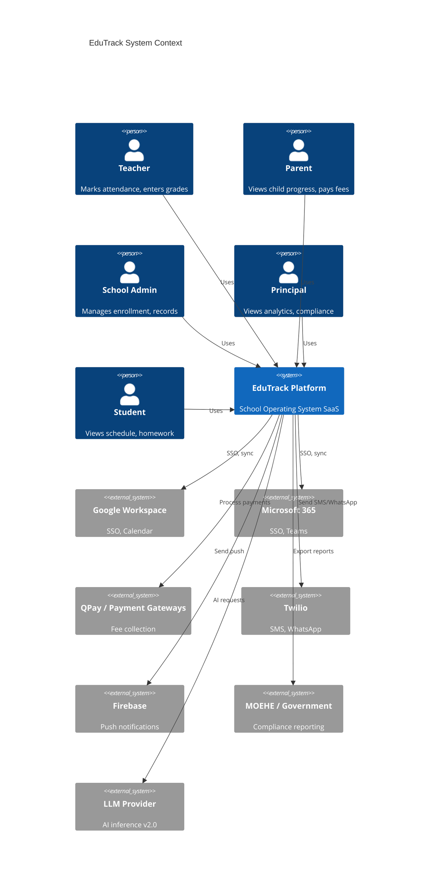
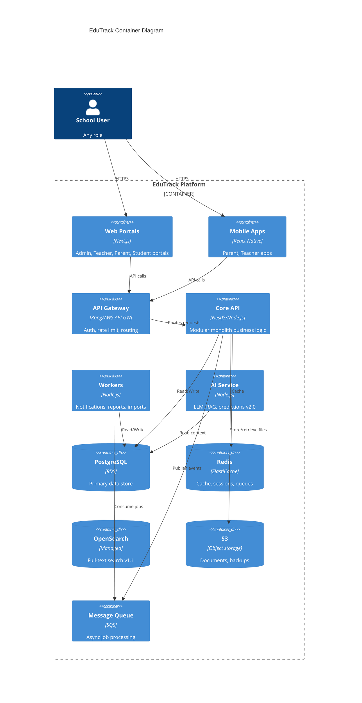
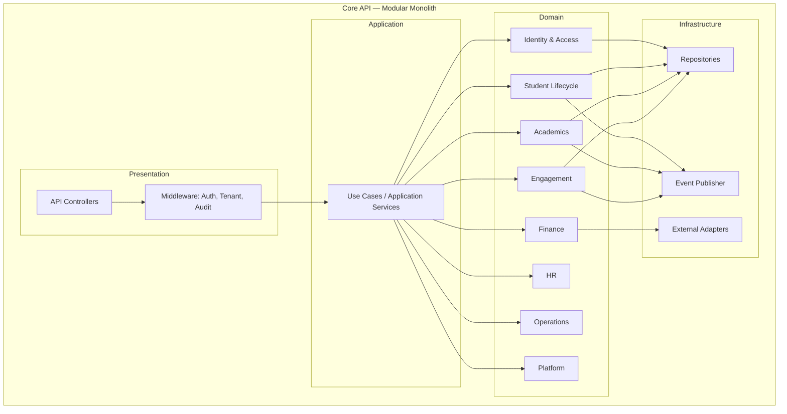

# EduTrack — Technical Architecture Document

| Field | Value |
|-------|-------|
| **Document ID** | EDU-ARCH-005 |
| **Version** | 1.0.0 |
| **Status** | Draft — Pending G5 Stakeholder Approval |
| **Phase** | Phase 5 — Technical Architecture |
| **Predecessor** | EDU-DISC-001 · EDU-STRAT-002 · EDU-PRD-003 · EDU-PX-004 — **Approved** |
| **Successor** | Phase 6 — Implementation (pending G5) |
| **Author** | EduTrack Executive Architecture Board |
| **Last Updated** | 2026-07-08 |
| **Classification** | Internal — Confidential |

---

## Document Control

| Version | Date | Author | Changes |
|---------|------|--------|---------|
| 1.0.0 | 2026-07-08 | Architecture Board | Initial Technical Architecture release |

### Architecture Artifact Convention

| Prefix | Meaning | Example |
|--------|---------|---------|
| `TDR-###` | Technology Decision Record | TDR-001 |
| `ARC-###` | Architecture Requirement | ARC-SEC-001 |
| `BC-###` | Bounded Context | BC-ACADEMICS |
| `SLO-###` | Service Level Objective | SLO-AVL-001 |

### Approval Gate — G5: Technical Architecture Approval

| Role | Name | Signature | Date | Status |
|------|------|-----------|------|--------|
| Chief Technology Officer | | | | Pending |
| Chief Software Architect | | | | Pending |
| Enterprise Architect | | | | Pending |
| Cloud Architect | | | | Pending |
| Security Architect | | | | Pending |
| Database Architect | | | | Pending |
| AI Systems Architect | | | | Pending |
| VP Engineering | | | | Pending |

**Gate criteria:** Architecture principles approved; C4 model validated; multi-tenant strategy agreed; security architecture reviewed by security lead; infrastructure strategy approved by DevOps; all P0 TDRs signed off; no open P0 technical ambiguities blocking implementation.

**Explicit constraint:** No source code, API endpoint specifications, database DDL, UI designs, or infrastructure-as-code shall be produced until **G5 approval** is recorded.

---

## Table of Contents

1. [Executive Summary](#1-executive-summary)
2. [Architecture Principles](#2-architecture-principles)
3. [High-Level Architecture](#3-high-level-architecture)
4. [C4 Architecture](#4-c4-architecture)
5. [Domain Model](#5-domain-model)
6. [Multi-Tenant Strategy](#6-multi-tenant-strategy)
7. [Data Architecture](#7-data-architecture)
8. [Security Architecture](#8-security-architecture)
9. [Infrastructure Strategy](#9-infrastructure-strategy)
10. [Performance Strategy](#10-performance-strategy)
11. [AI Architecture](#11-ai-architecture)
12. [Integration Architecture](#12-integration-architecture)
13. [Observability](#13-observability)
14. [Disaster Recovery](#14-disaster-recovery)
15. [Technical Risks](#15-technical-risks)
16. [Technology Decision Records](#16-technology-decision-records)
17. [Engineering Standards](#17-engineering-standards)
18. [Readiness Assessment](#18-readiness-assessment)

---

## 1. Executive Summary

This Technical Architecture Document defines **how EduTrack will be engineered** — the single engineering reference that governs all implementation decisions from MVP through global scale.

EduTrack is an enterprise multi-tenant B2B SaaS School Operating System targeting 10,000+ schools, millions of users, multi-region deployment, and future AI expansion. Architecture must deliver **MENA-native compliance**, **99.9% availability**, and **30–60 day school onboarding** without sacrificing long-term maintainability.

### Architecture Vision

> **Build a modular, API-first, cloud-native platform on a single logical codebase with clear domain boundaries — engineered to scale from 15 pilot schools to 10,000+ institutions without re-architecture.**

The platform follows a **phased complexity curve**: start as a well-structured modular monolith; extract services only when domain scale, team size, or compliance isolation demands it.

### Engineering Principles

| Principle | Statement |
|-----------|-----------|
| **Correctness over cleverness** | School data errors harm children and families; prefer explicit, auditable logic |
| **API-first** | Every capability exposed via versioned APIs before UI |
| **Tenant isolation by default** | No query, cache key, or job runs without tenant context |
| **Boring technology for core** | PostgreSQL, Redis, proven cloud services for transactional paths |
| **Event notification, not event sourcing** | Domain events for integration; avoid full event-sourcing complexity in MVP |
| **Security embedded** | Not a phase; RBAC, encryption, audit from day one |
| **Observable everything** | If it runs in production, it emits metrics, logs, and traces |
| **Design for deletion** | GDPR/PDPL erasure and retention are architectural requirements |

### Scalability Goals

| Dimension | Y1 (MVP) | Y3 | Y5 (Target) |
|-----------|----------|-----|-------------|
| Schools (tenants) | 15 | 150+ | 10,000+ |
| Total users | 25,000 WASS | 500,000 WASS | 3,000,000+ WASS |
| Students per school | 5,000 | 10,000 | 10,000 |
| Campuses per group | 5 | 20 | 50 |
| Peak concurrent users (platform) | 2,000 | 25,000 | 200,000 |
| API requests/second (peak) | 500 | 5,000 | 50,000 |
| Data storage per tenant (avg) | 10 GB | 50 GB | 100 GB |

### Reliability Goals

| Metric | Target |
|--------|--------|
| **Availability SLA** | 99.9% (≤43 min downtime/month) |
| **RPO** | ≤1 hour |
| **RTO** | ≤4 hours |
| **P0 incident response** | ≤15 minutes acknowledge; ≤1 hour mitigate |
| **Deployment frequency** | Weekly (MVP); daily (mature) |
| **Change failure rate** | <5% |
| **Mean time to recovery** | <1 hour |

### Security Philosophy

Security is a **product feature**, not an overhead:

1. **Zero trust between services** — Mutual authentication; least privilege
2. **Defense in depth** — WAF, network segmentation, application RBAC, encryption, audit
3. **Child data is special** — Enhanced consent, access logging, parental controls
4. **Compliance by design** — PDPL, GDPR, SOC 2 controls embedded in architecture
5. **Assume breach** — Audit trails, anomaly detection, incident playbooks
6. **Secrets never in code** — Centralized secrets management with rotation

---

## 2. Architecture Principles

### API First

All product capabilities are designed as **versioned REST APIs** (GraphQL optional for analytics in v2.0). UI portals are API clients. Third-party integrations consume the same APIs as first-party UIs. API contracts are documented before implementation begins (Phase 6).

**Business justification:** Enables marketplace ecosystem, mobile apps, white-label, and national platform integration without duplicate logic.

### Modular Monolith vs Microservices

| Approach | Decision |
|----------|----------|
| **MVP (v1.0–v2.0)** | **Modular Monolith** |
| **v3.0+** | Selective service extraction |

**Justification:**

| Factor | Modular Monolith | Microservices (day one) |
|--------|------------------|-------------------------|
| Team size (Y1: 25–35) | ✓ Manageable | ✗ Operational overhead |
| Time to market | ✓ Faster | ✗ Slower |
| Transactional consistency | ✓ ACID in-process | ✗ Distributed transactions |
| Deployment complexity | ✓ Single deploy unit | ✗ Orchestration required |
| Domain clarity | ✓ Enforced via modules | Requires mature boundaries |

**Extraction candidates (when triggered):** Notifications service, AI inference service, Report generation worker, Payment webhook processor.

**Trigger criteria for extraction:** Independent scaling need >3× core API; separate team ownership; compliance isolation requirement; P95 latency SLO breach attributable to module.

### Event-Driven Architecture

Domain events published to an internal event bus for:

- Cross-module reactions (enrollment → provision parent account)
- Notification dispatch
- Audit enrichment
- Integration webhooks
- Future analytics pipeline

**Pattern:** Transactional outbox — events written atomically with domain changes, then published asynchronously. Not full event sourcing.

### Domain-Driven Design

- **Bounded contexts** per major module (Admissions, Academics, Finance, etc.)
- **Ubiquitous language** aligned with PRD terminology
- **Aggregates** enforce invariants (Student, Enrollment, Gradebook, Invoice)
- **Anti-corruption layers** for external integrations (payment gateways, MOEHE)

### Clean Architecture

Layering within each module:

```
Presentation (API controllers, DTOs)
    ↓
Application (use cases, orchestration)
    ↓
Domain (entities, value objects, domain services, events)
    ↓
Infrastructure (persistence, messaging, external adapters)
```

**Dependency rule:** Domain has zero infrastructure dependencies. Infrastructure implements domain interfaces.

### SOLID Principles

Applied at module and class level. Particular emphasis on **Single Responsibility** (one use case per application service) and **Dependency Inversion** (repository interfaces in domain).

### Twelve-Factor App

| Factor | EduTrack Application |
|--------|---------------------|
| Codebase | Monorepo with modular packages |
| Dependencies | Explicitly declared; pinned versions |
| Config | Environment variables; secrets in vault |
| Backing services | PostgreSQL, Redis, S3 as attached resources |
| Build/release/run | Strict separation via CI/CD |
| Processes | Stateless API; stateful work in workers |
| Port binding | Self-contained containers |
| Concurrency | Horizontal scale via process model |
| Disposability | Fast startup; graceful shutdown |
| Dev/prod parity | Containerized environments |
| Logs | Stdout streams to centralized logging |
| Admin processes | One-off jobs as CLI/worker tasks |

### Cloud Native Principles

- Containerized workloads on managed Kubernetes (EKS) or equivalent
- Infrastructure as Code (Terraform)
- Managed services over self-hosted where cost-effective
- Auto-scaling based on metrics
- Immutable infrastructure
- Health checks and circuit breakers

---

## 3. High-Level Architecture

### System Overview

```
┌─────────────────────────────────────────────────────────────────────────────┐
│                              CLIENT LAYER                                    │
│  Admin Web │ Teacher Web │ Parent Web │ Student Web │ Mobile Apps (RN)      │
└──────────────────────────────────┬──────────────────────────────────────────┘
                                   │ HTTPS / TLS 1.3
┌──────────────────────────────────▼──────────────────────────────────────────┐
│                           EDGE LAYER                                         │
│  CDN (static) │ WAF │ Load Balancer │ API Gateway │ Rate Limiter            │
└──────────────────────────────────┬──────────────────────────────────────────┘
                                   │
┌──────────────────────────────────▼──────────────────────────────────────────┐
│                        APPLICATION LAYER                                     │
│  ┌─────────────────────────────────────────────────────────────────────┐   │
│  │              EduTrack Core API (Modular Monolith)                    │   │
│  │  Identity │ SIS │ Academics │ Engagement │ Finance* │ HR* │ Settings│   │
│  └─────────────────────────────────────────────────────────────────────┘   │
│  ┌──────────────┐  ┌──────────────┐  ┌──────────────┐  ┌──────────────┐  │
│  │ Notification │  │ Report       │  │ Integration  │  │ AI Service*  │  │
│  │ Worker       │  │ Worker       │  │ Worker       │  │ (v2.0+)      │  │
│  └──────────────┘  └──────────────┘  └──────────────┘  └──────────────┘  │
└──────────────────────────────────┬──────────────────────────────────────────┘
                                   │
┌──────────────────────────────────▼──────────────────────────────────────────┐
│                           DATA LAYER                                         │
│  PostgreSQL (primary) │ Redis (cache/sessions) │ OpenSearch (search)          │
│  S3 (documents) │ Message Queue (SQS) │ Vector Store* (AI v2.0)            │
└─────────────────────────────────────────────────────────────────────────────┘
                                   │
┌──────────────────────────────────▼──────────────────────────────────────────┐
│                      OBSERVABILITY & OPERATIONS                                  │
│  Metrics │ Logs │ Traces │ Alerts │ Status Page │ Backup │ DR                   │
└─────────────────────────────────────────────────────────────────────────────────┘
```

### Frontend

| Portal | Technology | Hosting | Notes |
|--------|------------|---------|-------|
| **Admin Portal** | Next.js (React, TypeScript) | CDN + SSR/SSG hybrid | Desktop-first; RTL support |
| **Teacher Portal** | Next.js | CDN + SSR | Mobile-responsive; PWA |
| **Parent Portal** | Next.js (web) + React Native (mobile) | CDN + app stores | Mobile-first |
| **Student Portal** | Next.js | CDN | v1.1 |
| **Operator Console** | Separate Next.js app | Internal network / VPN | Platform team only |

**Shared:** Component library (design system from PX-004), i18n (AR/EN), API client SDK (generated from OpenAPI).

**Business justification:** Next.js provides SSR for performance and SEO (CMS); React Native shares logic with web for parent/teacher mobile.

### Backend

| Component | Role |
|-----------|------|
| **Core API** | Modular monolith; all domain modules; REST v1 |
| **Background Workers** | Async jobs: notifications, reports, imports, webhooks |
| **Scheduler** | Cron jobs: reminders, data retention, report schedules |
| **API Gateway** | Rate limiting, auth validation, request routing, API keys |

**Runtime:** Node.js with TypeScript (NestJS framework) — see TDR-001.

### Authentication

| Mechanism | Use |
|-----------|-----|
| **Email/password** | Default for all users |
| **OAuth 2.0 / OIDC** | Google Workspace, Microsoft 365, Azure AD SSO |
| **MFA (TOTP)** | Required for Super Admin, Principal, Finance roles |
| **JWT access tokens** | Short-lived (15 min); API authentication |
| **Refresh tokens** | Rotating; httpOnly cookie or secure storage |
| **API keys** | Integration partners; scoped permissions |
| **Parent activation tokens** | One-time invite links |

**Identity store:** Core database with optional external IdP federation.

### Database

| Store | Purpose |
|-------|---------|
| **PostgreSQL 16+** | Primary transactional store; all domain data |
| **Read replicas** | Read-heavy queries (reports, search indexing) |
| **Connection pooling** | PgBouncer between API and PostgreSQL |

**Multi-tenant:** Shared database, shared schema, `tenant_id` on all tenant-scoped tables + Row-Level Security (RLS) — see TDR-003.

### Caching

| Layer | Technology | Use |
|-------|------------|-----|
| **Application cache** | Redis | Session, RBAC permissions, config, hot queries |
| **CDN cache** | CloudFront | Static assets, public CMS pages |
| **HTTP cache** | Cache-Control headers | Read-only public endpoints |

**Cache key pattern:** `{tenant_id}:{entity}:{id}` — tenant always first.

### Storage

| Type | Technology | Content |
|------|------------|---------|
| **Documents** | S3 (encrypted) | Admissions docs, student files, reports |
| **Media** | Cloudinary + S3 fallback | Photos, optimized images |
| **Backups** | S3 (cross-region) | DB backups, audit archives |

### Background Jobs

| Queue | Technology | Job Types |
|-------|------------|-----------|
| **Primary queue** | AWS SQS | Notifications, imports, webhooks, report generation |
| **Dead letter queue** | SQS DLQ | Failed job retry and investigation |
| **Scheduler** | EventBridge / cron | Scheduled reports, reminders, retention |

**Idempotency:** All job handlers idempotent with deduplication keys.

### Notifications

| Channel | Provider | Pattern |
|---------|----------|---------|
| Email | Amazon SES / SendGrid | Template-based; queued |
| SMS | Twilio | Queued; rate-limited |
| Push | Firebase Cloud Messaging | Queued; device token registry |
| In-app | Internal | Real-time via WebSocket (Socket.io) or polling |
| WhatsApp | Twilio Business API | v2.0; template messages |

**Architecture:** Notification Worker consumes events; renders templates; dispatches to channel adapters; tracks delivery status.

### Search

| Phase | Technology | Scope |
|-------|------------|-------|
| MVP | PostgreSQL full-text search | Students, staff; <5,000 records per school |
| v1.1+ | OpenSearch | Cross-entity search; fuzzy matching; Arabic analyzers |

**Indexing:** Change Data Capture via domain events → search indexer worker.

### Analytics

| Layer | Technology | Purpose |
|-------|------------|---------|
| **Product analytics** | Internal events → data warehouse | WASS, adoption, funnels |
| **Operational analytics** | Application metrics | Performance, errors |
| **School analytics** | Core API + materialized views | Principal dashboards |
| **Data warehouse** | BigQuery / Redshift (v2.0) | Cross-tenant BI (anonymized) |

**Privacy:** Tenant analytics stay tenant-scoped; platform analytics anonymized and aggregated.

### AI Layer (v2.0+)

Separate **AI Service** with:

- LLM provider abstraction (Azure OpenAI primary; OpenAI fallback)
- Prompt template management
- RAG pipeline for school-specific context
- Inference queue with cost controls
- Human approval workflow integration

See Section 11.

### Monitoring

Prometheus-compatible metrics → Grafana dashboards. Custom business metrics (WASS, tenant health). Synthetic monitoring for critical flows.

### Logging

Structured JSON logs → centralized log aggregation (CloudWatch Logs / ELK). Correlation IDs across requests. PII redaction in logs.

### Backup

Automated daily PostgreSQL snapshots; continuous WAL archiving; S3 document versioning; 30-day retention minimum; cross-region replication.

### Disaster Recovery

Active-passive multi-AZ within primary region; cross-region backup for catastrophic recovery. See Section 14.

---

## 4. C4 Architecture

### Level 1 — Context Diagram



**Narrative:** EduTrack is the central system for school stakeholders. External systems are integrated via adapters; EduTrack does not replace national platforms but co-exists and exports data to them.

---

### Level 2 — Container Diagram



---

### Level 3 — Component Diagram (Core API)



**Module boundaries map to bounded contexts (Section 5).** Cross-module calls go through application services or domain events — never direct database access across modules.

---

### Level 4 — Code Boundaries (Conceptual)

| Package/Module | Responsibility | May Depend On |
|----------------|----------------|---------------|
| `identity` | Auth, users, roles, permissions | `platform` (shared) |
| `student-lifecycle` | Admissions, enrollment, student records | `identity`, `platform` |
| `academics` | Attendance, gradebook, scheduling, records | `student-lifecycle`, `platform` |
| `engagement` | Messaging, notifications, calendar | `identity`, `student-lifecycle`, `platform` |
| `finance` | Fees, accounting, invoices | `student-lifecycle`, `platform` |
| `hr` | Staff, leave, payroll | `identity`, `platform` |
| `operations` | Transport, clinic, library, inventory | `student-lifecycle`, `platform` |
| `insights` | Reports, analytics, AI hooks | All modules (read-only) |
| `platform` | Tenant, config, audit, integrations | None (shared kernel) |

**Rule:** No circular dependencies between domain modules. `platform` is the shared kernel.

---

## 5. Domain Model

### Bounded Contexts

| ID | Context | Core Responsibility | PRD Modules |
|----|---------|---------------------|-------------|
| BC-IDENTITY | Identity & Access | Users, auth, RBAC, SSO | Settings |
| BC-LIFECYCLE | Student Lifecycle | Admissions, enrollment, student records | Admissions, Enrollment, Student Mgmt |
| BC-ACADEMICS | Academics | Attendance, grades, scheduling, records | Attendance, Gradebook, Scheduling, Academic Records, Homework, Assessments |
| BC-ENGAGEMENT | Engagement | Messages, notifications, calendar | Communication, Notifications, Calendar |
| BC-FINANCE | Finance | Fees, invoicing, accounting | Finance, Accounting, Fees |
| BC-HR | Human Resources | Staff, leave, payroll | HR, Payroll |
| BC-OPERATIONS | Operations | Transport, clinic, library, assets | Transportation, Medical, Library, Inventory, Behavior |
| BC-INSIGHTS | Insights | Reports, analytics, AI | Reports, Analytics, AI |
| BC-PLATFORM | Platform | Tenant, config, audit, integrations | Settings, Integrations, Marketplace |

### Core Domains (Competitive Advantage)

| Domain | Why Core |
|--------|----------|
| **Student Lifecycle** | Single record architecture — key differentiator |
| **Academics** | Daily teacher/parent engagement — adoption driver |
| **Engagement** | Parent portal — NPS and retention |
| **Finance** | Expansion revenue — admissions-to-cash |

### Supporting Domains

| Domain | Role |
|--------|------|
| Identity & Access | Necessary but commoditized; leverage standards (OAuth, SAML) |
| Operations | Important for enterprise depth; not day-one MVP |
| HR | Expansion module; standard patterns |
| Insights | Aggregates from core domains |

### Shared Kernel (Platform)

| Concept | Description |
|---------|-------------|
| `TenantId` | Unique school/group identifier |
| `CampusId` | Sub-tenant within school group |
| `AcademicYear` | Temporal boundary for academic operations |
| `AuditEntry` | Immutable log of sensitive actions |
| `LocalizedString` | AR/EN value object |
| `Money` | Amount + currency value object |
| `PersonName` | AR/EN name value object |

### Key Aggregates

| Aggregate | Root Entity | Invariants |
|-----------|-------------|------------|
| **Student** | Student | One active enrollment per year; guardian required for activation |
| **Enrollment** | Enrollment | Capacity limits; status transitions enforced |
| **Applicant** | Applicant | Pipeline stage transitions; document completeness |
| **AttendanceSession** | AttendanceSession | Lock after deadline; one session per class per period per day |
| **Gradebook** | GradebookEntry | Grade changes audited; locked grades immutable |
| **Invoice** | Invoice | Line items sum to total; payment allocation rules |
| **StaffMember** | Staff | Linked to user account; leave balance non-negative |
| **Message** | MessageThread | Participants scoped to authorized relationships |
| **Tenant** | Tenant | Configuration isolated; branding per tenant |

### Entities vs Value Objects

| Type | Examples |
|------|----------|
| **Entities** (identity matters) | Student, Staff, Enrollment, Invoice, Applicant |
| **Value Objects** (immutable, no identity) | Address, PhoneNumber, Grade, AttendanceStatus, DateRange, LocalizedString, Money |

### Domain Events

| Event | Publisher | Consumers |
|-------|-----------|-----------|
| `StudentEnrolled` | Student Lifecycle | Engagement (provision parent), Finance (fee setup), Academics (roster) |
| `AttendanceRecorded` | Academics | Engagement (parent notification), Insights (analytics) |
| `GradesPublished` | Academics | Engagement (parent notification), Insights |
| `InvoiceIssued` | Finance | Engagement (parent notification) |
| `PaymentReceived` | Finance | Finance (reconciliation), Engagement (receipt) |
| `ApplicantAccepted` | Student Lifecycle | Enrollment (conversion trigger) |
| `UserCreated` | Identity | Engagement (welcome notification) |

**Delivery guarantee:** At-least-once via transactional outbox. Consumers must be idempotent.

---

## 6. Multi-Tenant Strategy

### Tenant Model

| Level | Description | Example |
|-------|-------------|---------|
| **Platform** | EduTrack operator | EduTrack Inc. |
| **Tenant (Organization)** | School or school group | "Doha International School Group" |
| **Campus** | Sub-unit within tenant | "DIS — West Bay Campus" |
| **User** | Person with role(s) scoped to tenant/campus | Teacher at Campus A |

### Tenant Isolation

| Layer | Strategy |
|-------|----------|
| **Database** | Shared schema; `tenant_id` column on all tenant tables; PostgreSQL RLS policies |
| **Application** | Tenant context injected from JWT/API key; middleware validates on every request |
| **Cache** | Tenant-prefixed keys; no shared cache entries across tenants |
| **Storage** | S3 prefix per tenant: `/{tenant_id}/...` |
| **Search** | Tenant filter on every query |
| **Queue** | Tenant ID in message payload; workers validate |
| **Logs** | Tenant ID in structured log fields |

**Isolation guarantee:** No API query or background job executes without validated tenant context. Cross-tenant access is architecturally impossible at application layer; RLS provides defense-in-depth at database layer.

### School Isolation

Single-campus school: `tenant_id` = school.  
School group: `tenant_id` = group; `campus_id` scopes data. Users may have campus-specific or group-wide roles.

### Data Ownership

| Rule | Specification |
|------|---------------|
| **Ownership** | School tenant owns all student, staff, and operational data |
| **EduTrack access** | Platform operator has zero default access to tenant data |
| **Support access** | Time-limited, school-authorized, fully audit-logged |
| **Export** | School can export all data at any time (PDPL/GDPR) |
| **Deletion** | School can request tenant deletion with 30-day grace |

### Configuration Strategy

| Config Type | Storage | Scope |
|-------------|---------|-------|
| **Platform defaults** | Code/seed data | Global |
| **Tenant config** | Database `tenant_settings` | Per school |
| **Campus overrides** | Database `campus_settings` | Per campus |
| **Feature flags** | Feature flag service (LaunchDarkly / custom) | Per tenant, per user |

### Branding Strategy (White-Label)

| Element | v1.0 | v3.0+ |
|---------|------|-------|
| Logo | Tenant upload | ✓ |
| Accent color | Tenant setting | ✓ |
| Custom domain | `school.edutrack.com` | `portal.schoolname.edu` |
| Full white-label | EduTrack branding visible | Partner branding only |
| Parent app name | "EduTrack Parent" | Configurable |

### Scaling Strategy

| Scale Trigger | Action |
|---------------|--------|
| >5,000 tenants | Shard read replicas; consider tenant sharding by region |
| >100 GB per large tenant | Dedicated storage prefix; optional dedicated DB schema |
| Government tenant | Dedicated tenancy option: isolated database instance |
| >50,000 concurrent users | Horizontal API scaling; CDN edge caching; worker pool expansion |

---

## 7. Data Architecture

### Conceptual Data Model

High-level entity relationships (not DDL):

```
Tenant ──< Campus ──< AcademicYear
    │
    ├──< User ──< RoleAssignment
    │
    ├──< Student ──< Guardian
    │       │
    │       ├──< Enrollment ──> Section ──> GradeLevel
    │       ├──< AttendanceRecord
    │       ├──< Grade
    │       ├──< Document
    │       └──< BehaviorIncident*
    │
    ├──< Applicant ──> (converts to) Student
    │
    ├──< Staff ──< LeaveRequest*
    │
    ├──< Invoice* ──< Payment*
    │
    └──< AuditLog (append-only)
```

### Logical Data Model Principles

| Principle | Rule |
|-----------|------|
| **Tenant scoping** | Every business table includes `tenant_id` (and `campus_id` where applicable) |
| **Soft delete** | `deleted_at` timestamp; no hard delete of student/grade/audit data |
| **Audit columns** | `created_at`, `created_by`, `updated_at`, `updated_by` on all mutable tables |
| **UUID primary keys** | External IDs are UUIDs; no sequential IDs exposed in APIs |
| **Normalization** | 3NF for transactional data; denormalized read models for reports |
| **Temporal data** | Academic year scopes enrollment, grades, attendance |

### Data Lifecycle

| Stage | Policy |
|-------|--------|
| **Active** | Current academic year data; full access |
| **Archived** | Previous academic years; read-only; compressed storage |
| **Retention** | Minimum 7 years for academic records (configurable per jurisdiction) |
| **Erasure** | PDPL/GDPR erasure requests processed within 30 days; audit log retained |

### Archiving

Annual archive job moves completed academic year data to archive tables/storage. Active queries default to current year. Historical access via explicit year selector.

### Retention

| Data Type | Retention |
|-----------|-----------|
| Academic records | 7+ years (jurisdiction-dependent) |
| Audit logs | 7 years minimum |
| Application logs | 90 days hot; 1 year cold |
| Notifications | 90 days |
| Session data | 30 days |
| Backups | 30 days rolling; 1 year annual snapshot |

### Audit Trail

| Requirement | Implementation |
|-------------|----------------|
| **Coverage** | 100% of sensitive actions (grades, enrollment, fees, permissions, data export) |
| **Immutability** | Append-only audit table; no updates or deletes |
| **Fields** | Actor, tenant, action, entity, before/after snapshot, timestamp, IP, correlation ID |
| **Access** | Super Admin and Principal (read-only) |

### Backup Policy

| Component | Frequency | Retention | Location |
|-----------|-----------|-----------|----------|
| PostgreSQL | Continuous WAL + daily snapshot | 30 days + annual | Cross-region S3 |
| Redis | Daily snapshot (sessions recoverable) | 7 days | Same region |
| S3 documents | Versioning enabled | Indefinite (tenant-controlled) | Cross-region replication |
| Configuration | Git + Terraform state backup | Indefinite | Separate account |

### Recovery Objectives

| Tier | RPO | RTO | Scope |
|------|-----|-----|-------|
| **Tier 1 — Critical** | 1 hour | 4 hours | Core API, database, authentication |
| **Tier 2 — Important** | 4 hours | 8 hours | Workers, search, reporting |
| **Tier 3 — Standard** | 24 hours | 24 hours | Analytics, AI, non-critical integrations |

---

## 8. Security Architecture

### Authentication Architecture

```
User → Portal → API Gateway → Auth Middleware → JWT Validation → Tenant Context → RBAC Check → Handler
```

| Mechanism | Specification |
|-----------|---------------|
| Password hashing | Argon2id |
| JWT signing | RS256 (asymmetric) |
| Token rotation | Refresh token rotation on use |
| Session invalidation | On password change, role change, admin revoke |
| Brute force protection | Rate limit + account lockout after 5 failures |
| SSO | OIDC federation; JIT user provisioning |

### Authorization — RBAC

| Layer | Enforcement |
|-------|-------------|
| **API Gateway** | Valid token required |
| **Middleware** | Tenant + user context extracted |
| **Application** | Permission check per use case (`canMarkAttendance`, `canViewGrades`) |
| **Database** | RLS policies as defense-in-depth |
| **Field-level** | Sensitive fields (medical, behavior) filtered by role |

**Permission model:** Role → Permissions → Resources. Permissions cached in Redis (TTL 5 min; invalidated on role change).

### MFA

| Role Category | MFA Required |
|---------------|-------------|
| Super Admin, Principal, Finance | Yes (TOTP) |
| Teacher, Parent, Student | Optional (encouraged for parents) |
| API integrations | API key + IP allowlist |

### Encryption

| State | Standard |
|-------|----------|
| **In transit** | TLS 1.3 minimum; HSTS enabled |
| **At rest (database)** | AES-256 (RDS encryption) |
| **At rest (S3)** | SSE-S3 or SSE-KMS |
| **At rest (Redis)** | Encryption in transit + at rest |
| **Backups** | Encrypted with KMS |
| **PII fields** | Application-level encryption for national ID numbers (optional per tenant) |

### Secrets Management

| Secret Type | Storage |
|-------------|---------|
| Database credentials | AWS Secrets Manager |
| API keys (payment, SMS) | Secrets Manager; per-tenant where applicable |
| JWT signing keys | KMS; rotation every 90 days |
| OAuth client secrets | Secrets Manager |

**Rule:** Zero secrets in source code, environment files in git, or CI logs.

### Audit Logs

See Section 7. Security-relevant events additionally forwarded to SIEM (v2.0).

### Threat Model (STRIDE Summary)

| Threat | Mitigation |
|--------|------------|
| **Spoofing** | MFA, SSO, JWT validation, API key rotation |
| **Tampering** | TLS, audit logs, immutable grade records, checksums on exports |
| **Repudiation** | Comprehensive audit trail, signed webhooks |
| **Information disclosure** | Tenant isolation, RLS, RBAC, encryption, PII redaction in logs |
| **Denial of service** | WAF, rate limiting, auto-scaling, CDN |
| **Elevation of privilege** | RBAC, permission caching invalidation, principle of least privilege |

### OWASP Top 10 Mitigations

| Risk | Mitigation |
|------|------------|
| A01 Broken Access Control | RBAC + RLS + tenant middleware; penetration testing |
| A02 Cryptographic Failures | TLS 1.3, AES-256 at rest, Argon2id |
| A03 Injection | Parameterized queries (ORM); input validation; WAF |
| A04 Insecure Design | Threat modeling; security review per epic |
| A05 Security Misconfiguration | IaC; hardened container images; CIS benchmarks |
| A06 Vulnerable Components | Dependabot; monthly dependency audit |
| A07 Auth Failures | MFA, rate limiting, session management |
| A08 Data Integrity Failures | Signed JWTs; webhook signatures; audit logs |
| A09 Logging Failures | Structured logging; SIEM; alerting |
| A10 SSRF | Allowlist for outbound URLs; no user-controlled fetch |

### PDPL Compliance (Qatar/GCC)

| Requirement | Architectural Control |
|-------------|----------------------|
| Data residency | GCC region hosting (AWS Bahrain) |
| Consent management | Consent records linked to student/guardian |
| Right to access | Data export API |
| Right to erasure | Erasure workflow with audit retention |
| Data minimization | Field-level access; retention policies |
| Breach notification | Incident response playbook; audit trail |

### GDPR Readiness

| Requirement | Control |
|-------------|---------|
| Lawful basis | Documented per data category |
| DPO | Designated; privacy impact assessments |
| Cross-border transfer | SCCs; data residency options |
| Data portability | Export in machine-readable format |
| Privacy by design | Default minimal data collection |

---

## 9. Infrastructure Strategy

### Cloud Provider Recommendation

| Provider | Role | Region |
|----------|------|--------|
| **AWS (Primary)** | Production, staging, DR backups | `me-south-1` (Bahrain) — GCC data residency |
| **AWS (Secondary)** | DR failover, global CDN origin | `eu-west-1` (Ireland) — backup only |
| **Azure (Optional)** | Enterprise SSO (Azure AD); AI (Azure OpenAI) | UAE North — if customer requires |

**Recommendation:** AWS as primary cloud — see TDR-002. Bahrain region satisfies Qatar PDPL data residency expectations.

### Regions

| Phase | Deployment |
|-------|-------------|
| **v1.0 MVP** | Single region: AWS Bahrain (active-active AZs) |
| **v2.0** | Add UAE edge caching; evaluate Saudi region for KSA tenants |
| **v3.0+** | Multi-region active-passive for DR; data residency per country |

### Networking

```
Internet → CloudFront (CDN) → WAF → ALB → EKS (API pods)
                                    → EKS (Worker pods)
Internal: VPC with public/private subnets
          NAT Gateway for outbound
          VPC endpoints for S3, SQS, Secrets Manager
          No direct database exposure to internet
```

| Component | Purpose |
|-----------|---------|
| **VPC** | Isolated network per environment |
| **Subnets** | Public (ALB, NAT); Private (EKS, RDS, Redis) |
| **Security Groups** | Least-privilege port access |
| **WAF** | OWASP rule set; rate limiting; geo-blocking (optional) |
| **VPC Endpoints** | Private connectivity to AWS services |

### CDN

| Content | CDN |
|---------|-----|
| Static assets (JS, CSS, images) | CloudFront |
| Public CMS pages | CloudFront with cache |
| API responses | No CDN (dynamic) |
| Documents | Signed S3 URLs (no CDN for private docs) |

### Load Balancing

| Layer | Technology |
|-------|------------|
| **External** | Application Load Balancer (ALB) |
| **Internal** | Kubernetes service load balancing |
| **API Gateway** | Kong or AWS API Gateway for rate limiting and API keys |

### Autoscaling

| Component | Trigger | Min | Max |
|-----------|---------|-----|-----|
| API pods | CPU >70% or request latency P95 >500ms | 2 | 20 (Y1); 100 (Y5) |
| Worker pods | Queue depth >100 messages | 1 | 10 |
| RDS | Connection count / CPU | 1 primary + 1 replica | Add replicas |
| Redis | Memory >80% | 1 node | Cluster mode 3 nodes |

### Container Strategy

| Aspect | Decision |
|--------|----------|
| **Orchestration** | Amazon EKS (Kubernetes) |
| **Container runtime** | containerd |
| **Image registry** | Amazon ECR |
| **Base images** | Distroless or Alpine; scanned in CI |
| **Pod sizing** | API: 512MB–1GB RAM; Workers: 256MB–512MB |
| **Health checks** | Liveness + readiness probes |

### CI/CD

```
Developer → Git Push → GitHub Actions
    → Lint + Unit Tests
    → Build Docker Image → ECR
    → Deploy to Dev (auto)
    → Integration Tests
    → Deploy to Staging (auto on main)
    → Manual approval gate
    → Deploy to Production (blue-green)
    → Smoke tests
    → Rollback on failure
```

| Stage | Trigger | Approval |
|-------|---------|----------|
| Dev | Every push to feature branch | None |
| Staging | Merge to `main` | None |
| Production | Release tag | Engineering lead + QA sign-off |

### Environment Strategy

| Environment | Purpose | Data | URL Pattern |
|-------------|---------|------|-------------|
| **Development** | Engineer local + shared dev | Synthetic | `dev.edutrack.internal` |
| **Testing/QA** | Automated + manual QA | Anonymized seed | `test.edutrack.io` |
| **Staging** | Pre-production validation | Production-like anonymized | `staging.edutrack.io` |
| **Production** | Live tenants | Real | `{tenant}.edutrack.com` |
| **Sandbox** | School evaluation (30-day) | Demo data | `sandbox.edutrack.io` |

**Isolation:** Separate AWS accounts per environment (recommended) or separate VPCs minimum.

---

## 10. Performance Strategy

### Caching Strategy

| Layer | What | TTL | Invalidation |
|-------|------|-----|--------------|
| CDN | Static assets | 1 year (hashed filenames) | Deploy |
| Redis — RBAC | User permissions | 5 min | On role change event |
| Redis — Config | Tenant settings | 15 min | On settings update |
| Redis — Hot queries | Student search, dashboards | 1–5 min | On entity update event |
| Application | In-process (per pod) | Request-scoped | N/A |

### Lazy Loading

- Portal routes: code-split by module (admin, teacher, parent)
- Student lists: paginated (25/50/100); virtual scroll for large lists
- Dashboard widgets: independent API calls; skeleton loading per widget
- Images: lazy load below fold; Cloudinary responsive URLs

### Background Processing

| Task | Why Background | SLA |
|------|---------------|-----|
| Report generation | CPU-intensive | <30 seconds async |
| Bulk import (1,000 records) | Long-running | <5 minutes |
| Notification dispatch | External API latency | <5 minutes delivery |
| Search indexing | Decoupled from write path | <10 seconds index lag |
| AI inference | LLM latency | <10 seconds |

### Database Optimization

| Technique | Application |
|-----------|-------------|
| Indexes | On `tenant_id` + common query patterns |
| Connection pooling | PgBouncer; max 100 connections per API pod |
| Read replicas | Reports, analytics, search indexing |
| Materialized views | Dashboard aggregations (refreshed hourly) |
| Query monitoring | pg_stat_statements; slow query alerts >500ms |
| Partitioning | Audit logs by month (v2.0); attendance by academic year |

### Horizontal vs Vertical Scaling

| Component | Primary Strategy |
|-----------|-----------------|
| API | Horizontal (more pods) |
| Workers | Horizontal |
| PostgreSQL | Vertical first (instance size); then read replicas; sharding at 10K+ tenants |
| Redis | Vertical → cluster mode |
| OpenSearch | Horizontal (add nodes) |

### Performance Budgets

| Metric | Budget |
|--------|--------|
| P95 API read | <500 ms |
| P95 API write | <800 ms |
| P95 page load (portal) | <2 seconds |
| P95 attendance save (30 students) | <3 seconds |
| P95 search (5,000 students) | <2 seconds |
| JavaScript bundle (initial) | <300 KB gzipped |
| Time to interactive | <3 seconds on 4G |

### Expected Concurrent Users

| Scenario | Concurrent Users | API RPS |
|----------|-----------------|---------|
| Normal school day (Y1, 15 schools) | 500 | 100 |
| Peak morning attendance (Y1) | 2,000 | 500 |
| Normal (Y3, 150 schools) | 15,000 | 3,000 |
| Peak (Y3) | 25,000 | 5,000 |
| Platform scale (Y5) | 200,000 | 50,000 |

**Load testing:** Simulate peak attendance window before each major release.

---

## 11. AI Architecture

### AI Service Layer

```
Core API → AI Gateway (rate limit, auth, cost tracking)
    → Prompt Manager (templates, versioning)
    → Context Builder (RAG retrieval)
    → LLM Provider Adapter (Azure OpenAI / OpenAI)
    → Response Validator (safety, format)
    → Human Approval Queue (if required)
    → Response to caller
```

**Deployment:** Separate service (container) from Core API — extractable from day one of AI features.

### LLM Integration Strategy

| Aspect | Decision |
|--------|----------|
| **Primary provider** | Azure OpenAI (enterprise SLA, data residency options) |
| **Fallback** | OpenAI API |
| **Models** | GPT-4 class for generation; smaller model for classification |
| **Data policy** | No training on tenant data; zero-retention API calls where available |
| **Region** | Deploy in region closest to tenant data residency |

### Prompt Management

| Feature | Specification |
|---------|---------------|
| **Templates** | Versioned prompt templates in database |
| **Variables** | Tenant-safe variable injection (student name, grade, etc.) |
| **A/B testing** | Template version comparison (v3.0) |
| **Audit** | Full prompt + response logged for AI actions |
| **Localization** | AR/EN prompt variants |

### RAG Readiness

| Component | Purpose |
|-----------|---------|
| **Document ingestion** | School policies, curriculum guides, help articles |
| **Chunking** | Semantic chunks with metadata (tenant, module, language) |
| **Embedding** | Vector embeddings via provider API |
| **Retrieval** | Top-K similarity search filtered by tenant |
| **Context injection** | Retrieved chunks appended to prompt |

### Vector Storage (Conceptual)

| Phase | Technology |
|-------|------------|
| v2.0 | pgvector extension in PostgreSQL (tenant-scoped) |
| v3.0+ | Dedicated vector database (Pinecone / OpenSearch k-NN) if scale requires |

**Tenant isolation:** Vectors tagged with `tenant_id`; retrieval always filtered.

### Model Governance

| Control | Implementation |
|---------|----------------|
| Feature flags | Per-tenant AI feature enablement |
| Cost caps | Monthly inference budget per tenant |
| Rate limits | Requests per minute per tenant |
| Content filtering | Provider safety filters + custom blocklist |
| Bias monitoring | Quarterly model output audit by demographic |
| Model versioning | Track model version in audit log |

### Human Approval

| AI Action | Auto | Requires Approval |
|-----------|------|-------------------|
| Dashboard insight | ✓ | |
| At-risk flag | ✓ (with confidence) | |
| Report card narrative | | ✓ Teacher |
| Parent message draft | | ✓ Teacher |
| Grade suggestion | | ✓ Teacher (never auto-applied) |
| Timetable suggestion | | ✓ Admin |

### Cost Optimization

| Strategy | Savings |
|----------|---------|
| Smaller models for classification | 80% cost reduction vs GPT-4 |
| Response caching (identical queries) | 30–50% |
| Batch inference for reports | 40% |
| Tenant cost caps | Prevent runaway |
| Prompt compression | Reduce token count |

---

## 12. Integration Architecture

### Integration Pattern

```
External System ←→ Integration Adapter ←→ Core API / Worker
                         ↕
                   Webhook Receiver
                   Event Publisher
```

**Anti-corruption layer:** Each integration has a dedicated adapter module that translates external formats to domain models.

### External APIs

| Integration | Direction | Pattern | Auth |
|-------------|-----------|---------|------|
| **Google Workspace** | Bidirectional | OAuth 2.0; Calendar sync via API | OAuth |
| **Microsoft 365 / Azure AD** | Bidirectional | OIDC SSO; Graph API for calendar | OAuth/OIDC |
| **Google Classroom** | Bidirectional | Roster sync; assignment link | OAuth |
| **Microsoft Teams** | Outbound | Meeting link generation | OAuth |
| **Zoom** | Outbound | Meeting scheduling | API key |
| **QPay** | Inbound (webhook) | Payment callback | Signed webhook |
| **Moyasar** | Inbound | Payment callback (Saudi) | Signed webhook |
| **Stripe** | Inbound | International payments | Webhook + API key |
| **MOEHE** | Outbound | Compliance export file | API key / SFTP |
| **Toddle / ManageBac** | Bidirectional | Roster + grade passback | OAuth + API key |
| **Xero / QuickBooks** | Outbound | Journal entry export | OAuth |
| **Twilio** | Outbound | SMS, WhatsApp | API key |
| **Firebase (FCM)** | Outbound | Push notifications | Service account |
| **Cloudinary** | Bidirectional | Image upload/transform | API key |
| **Amazon SES** | Outbound | Email delivery | IAM |

### Identity Providers

| Provider | Protocol | Provisioning |
|----------|----------|-------------|
| Google Workspace | OIDC | JIT (Just-In-Time) |
| Azure AD | OIDC / SAML 2.0 | JIT + SCIM (v2.0) |
| Local | Email/password | Manual + invite |

### Payment Providers

| Provider | Region | Flow |
|----------|--------|------|
| QPay | Qatar | Parent portal → QPay hosted page → webhook → reconcile |
| Moyasar | Saudi | Same pattern |
| Stripe | International | Same pattern |

**Idempotency:** Payment webhooks processed with idempotency key; duplicate webhooks safely ignored.

### Government Systems

| System | Integration Type |
|--------|-----------------|
| MOEHE (Qatar) | Scheduled export + manual upload fallback |
| KHDA (Dubai) | Report template generation (PDF); no live API |
| ADEK (Abu Dhabi) | Report template generation |

**Principle:** Generate compliant exports; do not depend on government API availability for core operations.

### Webhook Architecture

| Feature | Specification |
|---------|---------------|
| **Inbound** | Dedicated webhook receiver endpoint; signature validation |
| **Outbound** | Tenant-configured webhook URLs for school integrations |
| **Retry** | 3 retries with exponential backoff |
| **DLQ** | Failed webhooks to dead letter queue for investigation |
| **Event types** | `student.enrolled`, `attendance.recorded`, `payment.received`, etc. |

---

## 13. Observability

### Monitoring

| Layer | Tool | Metrics |
|-------|------|---------|
| **Infrastructure** | CloudWatch / Prometheus | CPU, memory, disk, network |
| **Application** | Prometheus + Grafana | Request rate, latency, error rate |
| **Business** | Custom dashboards | WASS, tenant count, activation rate |
| **Synthetic** | Checkly / custom | Login, attendance, parent portal flows |

### Metrics (Key)

| Metric | Type | Alert Threshold |
|--------|------|-----------------|
| `http_request_duration_p95` | Histogram | >500ms for 5 min |
| `http_error_rate` | Counter | >1% for 5 min |
| `queue_depth` | Gauge | >500 for 10 min |
| `db_connection_pool_usage` | Gauge | >80% |
| `tenant_active_users` | Gauge | Business metric |
| `notification_delivery_rate` | Counter | <95% for 15 min |

### Tracing

| Aspect | Specification |
|--------|---------------|
| **Standard** | OpenTelemetry |
| **Propagation** | W3C Trace Context across API → workers |
| **Sampling** | 100% errors; 10% success (adjustable) |
| **Backend** | AWS X-Ray or Jaeger |
| **Correlation** | `trace_id` linked to `correlation_id` in logs |

### Logging

| Field | Always Present |
|-------|---------------|
| `timestamp` | ISO 8601 |
| `level` | error, warn, info, debug |
| `service` | api, worker, ai |
| `tenant_id` | When applicable |
| `user_id` | When authenticated |
| `correlation_id` | Request chain |
| `message` | Human-readable |

**PII rule:** Never log passwords, tokens, national IDs, or full student records.

### Alerting

| Severity | Response Time | Channel |
|----------|--------------|---------|
| **P0 — Critical** | 15 min | PagerDuty → on-call engineer |
| **P1 — High** | 1 hour | Slack + email |
| **P2 — Medium** | 4 hours | Slack |
| **P3 — Low** | Next business day | Ticket |

### Incident Management

| Phase | Action |
|-------|--------|
| Detect | Automated alert |
| Triage | On-call assesses severity |
| Communicate | Status page update within 30 min (P0) |
| Mitigate | Rollback, scale, or hotfix |
| Resolve | Root cause fix |
| Post-mortem | Blameless review within 48 hours |

### SLA / SLO / Error Budgets

| SLO | Target | Error Budget (monthly) |
|-----|--------|---------------------|
| **Availability** | 99.9% | 43.2 minutes downtime |
| **API latency P95** | <500ms | 0.1% requests may exceed |
| **Notification delivery** | 99% within 5 min | 1% may be delayed |
| **Data durability** | 99.999999999% (S3/RDS) | — |

**Error budget policy:** If availability budget exhausted, freeze feature releases; focus on reliability.

---

## 14. Disaster Recovery

### Business Continuity

| Scenario | Impact | Recovery |
|----------|--------|----------|
| Single AZ failure | Partial degradation | Auto-failover to second AZ (<5 min) |
| Region failure | Full outage | Restore from cross-region backup (RTO 4h) |
| Database corruption | Data integrity | Point-in-time recovery (RPO 1h) |
| Ransomware | Data/system compromise | Immutable backups; restore to clean environment |
| Provider outage | AWS regional | Status page; communicate; evaluate failover |

### Backup Strategy

See Section 7. Additional:

| Practice | Specification |
|----------|---------------|
| **Backup testing** | Monthly restore drill to staging |
| **Immutable backups** | S3 Object Lock for critical backups |
| **Backup encryption** | KMS-managed keys |
| **Cross-account** | Backups in separate AWS account |

### Recovery Strategy

| Tier | Procedure | RTO |
|------|-----------|-----|
| **AZ failover** | Automatic (multi-AZ RDS, EKS across AZs) | <5 min |
| **Service restart** | Kubernetes pod restart / redeploy | <15 min |
| **Database PITR** | Restore to point in time | <2 hours |
| **Full region recovery** | Restore backups to secondary region; DNS failover | <4 hours |

### High Availability

| Component | HA Strategy |
|-----------|-------------|
| API | Multi-AZ EKS; min 2 pods |
| Workers | Multi-AZ; auto-restart |
| PostgreSQL | Multi-AZ RDS; automatic failover |
| Redis | Multi-AZ ElastiCache with replica |
| S3 | 99.999999999% durability (inherent) |
| DNS | Route 53 health checks + failover |

### Regional Failover

| Phase | Strategy |
|-------|----------|
| v1.0 | Single region; cross-region backups only |
| v2.0 | Warm standby in secondary region (EU) |
| v3.0 | Active-passive multi-region with DNS failover |

---

## 15. Technical Risks

### Architecture Risks

| ID | Risk | Likelihood | Impact | Mitigation |
|----|------|-----------|--------|------------|
| AR-01 | Modular monolith becomes tangled monolith | Medium | High | Enforce module boundaries in CI; architecture reviews; no cross-module DB access |
| AR-02 | Premature microservices extraction | Medium | Medium | Extraction criteria defined; resist until triggers met |
| AR-03 | Event ordering issues across modules | Medium | Medium | Transactional outbox; idempotent consumers |
| AR-04 | Report generation impacts API performance | High | High | Dedicated worker pool; read replicas; async only |
| AR-05 | Multi-campus permission complexity | Medium | High | Campus-scoped middleware; early design partner testing |

### Security Risks

| ID | Risk | Likelihood | Impact | Mitigation |
|----|------|-----------|--------|------------|
| SR-01 | Cross-tenant data leakage | Low | Critical | RLS + middleware + penetration testing |
| SR-02 | Child data breach | Low | Critical | Encryption, RBAC, audit, incident response plan |
| SR-03 | API key compromise | Medium | High | Rotation, IP allowlist, scoped permissions |
| SR-04 | Supply chain attack (dependencies) | Medium | High | Dependabot, SCA scanning, pinned versions |
| SR-05 | Insufficient PDPL controls | Medium | Critical | Legal review; privacy-by-design checklist per epic |

### Scalability Risks

| ID | Risk | Likelihood | Impact | Mitigation |
|----|------|-----------|--------|------------|
| SC-01 | Morning attendance spike overloads API | High | High | Load testing; auto-scaling; attendance optimized endpoint |
| SC-02 | Large school (10K students) degrades search | Medium | Medium | OpenSearch migration at v1.1; pagination |
| SC-03 | Database becomes bottleneck at 1K+ tenants | Medium | High | Read replicas; query optimization; partitioning roadmap |
| SC-04 | Redis memory exhaustion | Medium | Medium | TTL policies; cluster mode; monitoring |

### Operational Risks

| ID | Risk | Likelihood | Impact | Mitigation |
|----|------|-----------|--------|------------|
| OP-01 | Small DevOps team overwhelmed | High | High | Managed services (EKS, RDS); IaC; runbooks |
| OP-02 | Deployment causes production incident | Medium | High | Blue-green deploy; automated rollback; feature flags |
| OP-03 | Backup restore untested | Medium | Critical | Monthly restore drills |
| OP-04 | On-call burnout | Medium | Medium | Rotation; runbooks; alert tuning |

### Mitigation Plans Summary

| Priority | Action | Owner | Timeline |
|----------|--------|-------|----------|
| P0 | Architecture boundary linting in CI | Principal Engineer | Sprint 1 |
| P0 | Load test attendance peak scenario | SRE | Pre-v1.0 |
| P0 | Penetration test | Security Architect | Pre-v1.0 |
| P0 | RLS policies on all tenant tables | Database Architect | Sprint 2–3 |
| P1 | Monthly backup restore drill | DevOps | Ongoing |
| P1 | Dependabot + SCA in CI | Security | Sprint 1 |
| P1 | Runbook for top 5 incident types | SRE | Pre-v1.0 |

---

## 16. Technology Decision Records

### TDR-001: Backend Runtime and Framework

| Field | Value |
|-------|-------|
| **Decision** | Node.js 20 LTS with TypeScript; NestJS framework |
| **Alternatives** | .NET 8 (C#), Java (Spring Boot), Go |
| **Pros** | Full-stack TypeScript with frontend; large talent pool; NestJS enforces modular structure; fast iteration |
| **Cons** | Node.js CPU-bound tasks less efficient; requires discipline for large codebases |
| **Business justification** | Shared language with React frontend reduces team friction; 30–60 day implementation target requires fast development |
| **Scalability** | Proven at SaaS scale (Notion, Linear, Vercel); horizontal scaling via pods |
| **Security** | Mature ecosystem; regular LTS updates |
| **Maintainability** | NestJS modules map to bounded contexts; strong typing |
| **Recommendation** | **Node.js + TypeScript + NestJS** |

---

### TDR-002: Cloud Provider

| Field | Value |
|-------|-------|
| **Decision** | AWS (primary); Azure for Azure AD / OpenAI integration |
| **Alternatives** | Azure (UAE region), GCP, multi-cloud |
| **Pros** | AWS Bahrain (me-south-1) for GCC residency; broadest managed service catalog; EKS maturity |
| **Cons** | AWS Bahrain region smaller than US/EU; some services limited |
| **Business justification** | Qatar PDPL data residency; competitor (Trasealla) uses AWS Bahrain |
| **Scalability** | Full auto-scaling toolkit |
| **Security** | SOC 2, ISO 27001 certified infrastructure |
| **Recommendation** | **AWS primary** |

---

### TDR-003: Multi-Tenant Data Isolation

| Field | Value |
|-------|-------|
| **Decision** | Shared database, shared schema, `tenant_id` + PostgreSQL RLS |
| **Alternatives** | Schema-per-tenant, database-per-tenant, siloed infrastructure |
| **Pros** | Cost-efficient; simple operations; easy cross-tenant platform analytics |
| **Cons** | RLS misconfiguration risk; noisy neighbor potential |
| **Mitigation** | RLS + application middleware + penetration testing |
| **Extraction path** | Database-per-tenant for government/sovereign tier |
| **Recommendation** | **Shared schema + RLS** |

---

### TDR-004: Primary Database

| Field | Value |
|-------|-------|
| **Decision** | PostgreSQL 16 (Amazon RDS) |
| **Alternatives** | MySQL, CockroachDB, MongoDB |
| **Pros** | ACID; JSON support; RLS; pgvector for AI; full-text search; mature |
| **Cons** | Vertical scaling limits (mitigated by read replicas) |
| **Recommendation** | **PostgreSQL 16** |

---

### TDR-005: Frontend Framework

| Field | Value |
|-------|-------|
| **Decision** | Next.js 14+ (React, TypeScript) for web; React Native for mobile |
| **Alternatives** | Angular, Vue/Nuxt, Flutter |
| **Pros** | SSR/SSG; React ecosystem; shared components; strong RTL support |
| **Cons** | React Native requires native module management |
| **Recommendation** | **Next.js + React Native** |

---

### TDR-006: Message Queue

| Field | Value |
|-------|-------|
| **Decision** | AWS SQS (standard + FIFO where ordering needed) |
| **Alternatives** | RabbitMQ, Apache Kafka, Redis Streams |
| **Pros** | Fully managed; no ops; integrates with AWS; DLQ built-in |
| **Cons** | Less flexible than Kafka for event streaming; vendor lock-in |
| **Extraction path** | Kafka if event streaming analytics needed at scale |
| **Recommendation** | **AWS SQS** |

---

### TDR-007: Caching

| Field | Value |
|-------|-------|
| **Decision** | Redis (Amazon ElastiCache) |
| **Alternatives** | Memcached, in-memory only |
| **Pros** | Sessions, cache, rate limiting, pub/sub; proven |
| **Cons** | Memory cost at scale |
| **Recommendation** | **Redis** |

---

### TDR-008: Search Engine

| Field | Value |
|-------|-------|
| **Decision** | PostgreSQL full-text (MVP); OpenSearch (v1.1+) |
| **Alternatives** | Elasticsearch, Algolia, Meilisearch |
| **Pros** | Postgres FTS avoids extra service for MVP; OpenSearch for Arabic analyzers at scale |
| **Cons** | Two-phase migration |
| **Recommendation** | **Phased: Postgres → OpenSearch** |

---

### TDR-009: Container Orchestration

| Field | Value |
|-------|-------|
| **Decision** | Amazon EKS (Kubernetes) |
| **Alternatives** | ECS Fargate, bare EC2, App Runner |
| **Pros** | Industry standard; portable; rich ecosystem; auto-scaling |
| **Cons** | Operational complexity; needs DevOps expertise |
| **Recommendation** | **EKS** |

---

### TDR-010: AI / LLM Provider

| Field | Value |
|-------|-------|
| **Decision** | Azure OpenAI (primary); OpenAI API (fallback) |
| **Alternatives** | Self-hosted LLM (Llama), Google Vertex AI |
| **Pros** | Enterprise SLA; data residency; content filtering; GPT-4 quality |
| **Cons** | Cost; vendor dependency |
| **Recommendation** | **Azure OpenAI** |

---

### TDR-011: Authentication Strategy

| Field | Value |
|-------|-------|
| **Decision** | Self-managed auth (JWT) with OIDC federation for SSO |
| **Alternatives** | Auth0, Cognito, Keycloak |
| **Pros** | Full control; no per-MAU cost; custom parent activation flow |
| **Cons** | Security responsibility; must implement correctly |
| **Mitigation** | Use battle-tested libraries (Passport.js); security review |
| **Recommendation** | **Self-managed + OIDC** (evaluate Auth0 at 100K+ users) |

---

### TDR-012: Infrastructure as Code

| Field | Value |
|-------|-------|
| **Decision** | Terraform |
| **Alternatives** | AWS CDK, Pulumi, CloudFormation |
| **Pros** | Cloud-agnostic; large community; state management |
| **Cons** | HCL learning curve |
| **Recommendation** | **Terraform** |

---

## 17. Engineering Standards

### Coding Standards

| Standard | Rule |
|----------|------|
| **Language** | TypeScript strict mode; no `any` without justification |
| **Linting** | ESLint + Prettier; enforced in CI |
| **Naming** | camelCase (variables), PascalCase (classes), kebab-case (files) |
| **File structure** | Module-based; co-locate tests |
| **Comments** | JSDoc for public APIs; no commented-out code |
| **Error handling** | Domain errors typed; never swallow exceptions |
| **Logging** | Structured JSON; correlation ID in every log |

### Git Strategy

| Practice | Rule |
|----------|------|
| **Repository** | Monorepo (Turborepo or Nx) |
| **Packages** | `apps/` (portals), `packages/` (shared, api, ui) |
| **Commits** | Conventional Commits (`feat:`, `fix:`, `chore:`) |
| **PR size** | Max 400 lines changed (guideline) |

### Branching Strategy

```
main (production-ready)
  └── develop (integration)
        └── feature/EDU-123-attendance-bulk-mark
        └── fix/EDU-456-grade-lock-bypass
        └── release/v1.0.0
```

| Branch | Purpose | Merge to |
|--------|---------|----------|
| `main` | Production releases | — |
| `develop` | Integration | `main` (via release) |
| `feature/*` | New features | `develop` |
| `fix/*` | Bug fixes | `develop` or `main` (hotfix) |
| `release/*` | Release preparation | `main` + `develop` |

### Code Reviews

| Rule | Specification |
|------|---------------|
| **Required** | 1 approval minimum; 2 for security-sensitive changes |
| **Reviewer** | Not the author; domain expert for module |
| **Checklist** | Tests, types, tenant isolation, audit logging, i18n |
| **SLA** | Review within 24 business hours |

### Testing Strategy

| Level | Coverage Target | Tools |
|-------|----------------|-------|
| **Unit** | ≥80% domain logic | Jest |
| **Integration** | All API endpoints | Supertest + test database |
| **E2E** | Critical flows (10+) | Playwright |
| **Load** | Peak attendance scenario | k6 |
| **Security** | OWASP top 10 | OWASP ZAP + manual pen test |
| **Accessibility** | WCAG 2.2 AA core flows | axe-core + manual |

### Documentation Standards

| Artifact | Location | Updated |
|----------|----------|---------|
| Architecture | `docs/` | Per phase gate |
| API spec | OpenAPI (generated) | Per API change |
| Runbooks | `docs/runbooks/` | Per incident type |
| ADRs/TDRs | `docs/adr/` | Per decision |
| README | Per package | Per package change |

### Release Strategy

| Type | Cadence | Process |
|------|---------|---------|
| **Major** | Quarterly+ | Full regression; migration scripts |
| **Minor** | Monthly | Feature release; staged rollout |
| **Patch** | As needed | Hotfix; can skip staging for P0 |
| **Feature flags** | Per feature | Gradual rollout: internal → pilot → 10% → 100% |

### Versioning

| Component | Scheme | Example |
|-----------|--------|---------|
| **API** | URL path: `/api/v1/` | Breaking change → v2 |
| **Application** | SemVer | 1.2.3 |
| **Database** | Sequential migrations | `20260708_create_students` |
| **Mobile apps** | SemVer; force update for breaking | 1.2.3 |

---

## 18. Readiness Assessment

### Architecture Readiness Score

| Dimension | Score (1–5) | Notes |
|-----------|-------------|-------|
| Architecture vision & principles | 5 | Clear modular monolith strategy with extraction path |
| High-level architecture | 5 | All layers defined |
| C4 model | 5 | Context, container, component documented |
| Domain model | 5 | Bounded contexts, aggregates, events defined |
| Multi-tenant strategy | 5 | Isolation at every layer |
| Data architecture | 4 | Conceptual model defined; logical DDL in Phase 6 |
| Security architecture | 5 | STRIDE, OWASP, PDPL, GDPR covered |
| Infrastructure strategy | 5 | AWS Bahrain; EKS; CI/CD; environments |
| Performance strategy | 5 | Budgets aligned with PRD NFRs |
| AI architecture | 4 | Layer defined; RAG path clear; detail grows with v2.0 |
| Integration architecture | 5 | All PRD integrations mapped |
| Observability | 5 | Metrics, traces, logs, SLOs, error budgets |
| Disaster recovery | 5 | RPO/RTO defined; HA strategy |
| Technology decisions | 5 | 12 TDRs with justification |
| Engineering standards | 5 | Git, testing, release, versioning |
| Risk mitigation | 4 | Risks identified; plans assigned |

**Overall Architecture Readiness Score: 4.8 / 5.0**

**Interpretation:** EduTrack Technical Architecture is **ready for G5 approval** and Phase 6 (Implementation). Remaining 0.2 gap: logical database DDL and OpenAPI specs are Phase 6 deliverables, not architecture blockers.

---

### Open Technical Questions

| ID | Question | Owner | Required Before |
|----|----------|-------|-----------------|
| OTQ-01 | Auth0 vs self-managed at what user scale? | Security Architect | v2.0 or 100K users |
| OTQ-02 | OpenSearch managed vs self-hosted on EKS? | Cloud Architect | v1.1 |
| OTQ-03 | Monorepo tool: Turborepo vs Nx? | Principal Engineer | Sprint 1 |
| OTQ-04 | WebSocket vs polling for in-app notifications? | Principal Engineer | v1.0 |
| OTQ-05 | pgvector vs dedicated vector DB for AI RAG? | AI Architect | v2.0 |
| OTQ-06 | Separate AWS accounts per environment? | Cloud Architect | Infrastructure setup |

---

### Engineering Checklist — G5

| # | Criterion | Status |
|---|-----------|--------|
| 1 | Architecture principles approved by CTO | ☐ Pending |
| 2 | Modular monolith vs microservices decision accepted | ☐ Pending |
| 3 | C4 diagrams reviewed by engineering leads | ☐ Pending |
| 4 | Bounded contexts map to team ownership | ☐ Pending |
| 5 | Multi-tenant isolation strategy approved by security | ☐ Pending |
| 6 | Data architecture approved by database architect | ☐ Pending |
| 7 | Security architecture passes security review | ☐ Pending |
| 8 | Infrastructure strategy approved by DevOps | ☐ Pending |
| 9 | Performance budgets aligned with PRD NFRs | ☐ Pending |
| 10 | AI architecture approved by AI lead | ☐ Pending |
| 11 | All P0 TDRs signed off | ☐ Pending |
| 12 | Engineering standards agreed by all leads | ☐ Pending |
| 13 | No open P0 technical ambiguities | ☐ Pending |
| 14 | Executive signatures recorded | ☐ Pending |

---

### Approval Recommendation

## **GO — Proceed to Phase 6 (Implementation)**

The Technical Architecture provides an enterprise-grade, scalable, secure foundation for EduTrack:

- **Modular monolith** enables fast MVP delivery with clear extraction path
- **AWS Bahrain** satisfies GCC data residency
- **PostgreSQL + RLS** provides cost-efficient multi-tenant isolation
- **Event-driven workers** decouple heavy operations from API
- **12 TDRs** document every major technology choice with business justification
- **99.9% SLA** achievable with multi-AZ HA architecture
- **AI layer** designed as separate service from day one of AI features

**Conditions for implementation start:**
1. G5 approval recorded
2. AWS account provisioned with IaC baseline
3. Monorepo scaffolded with CI pipeline
4. Security review of auth implementation plan
5. Pilot school tenant provisioned in staging

---

### Approval Gate: G5 — Technical Architecture Approval

Upon **G5 approval**, proceed to **Phase 6: Implementation** (sprint-based development per PRD release plan).

**Do not begin source code development until G5 approval is recorded.**

---

*End of Document — EDU-ARCH-005 v1.0.0*
